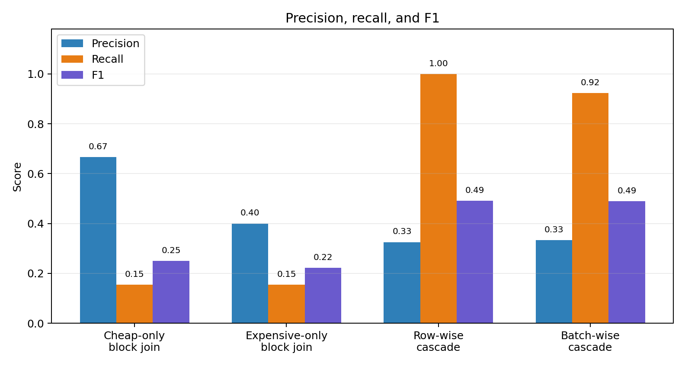
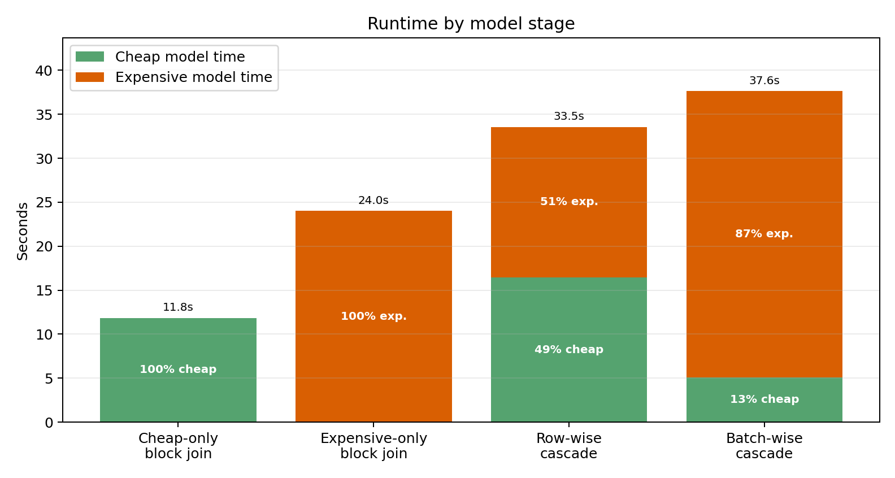
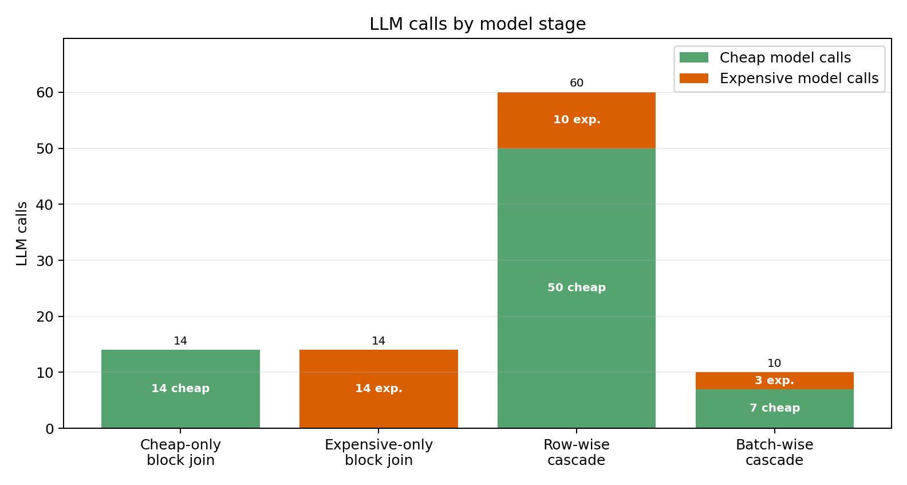
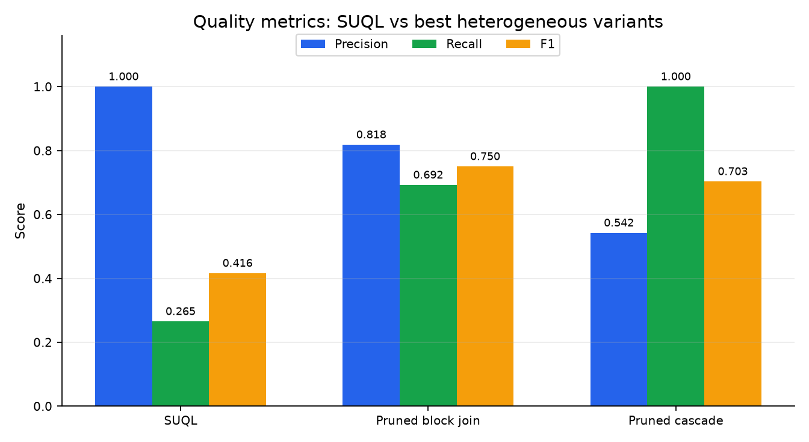
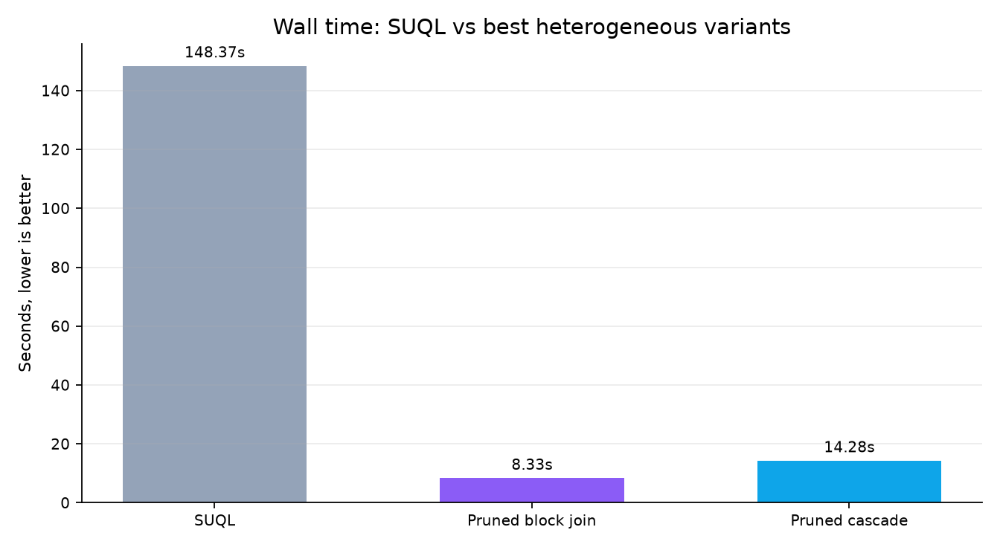
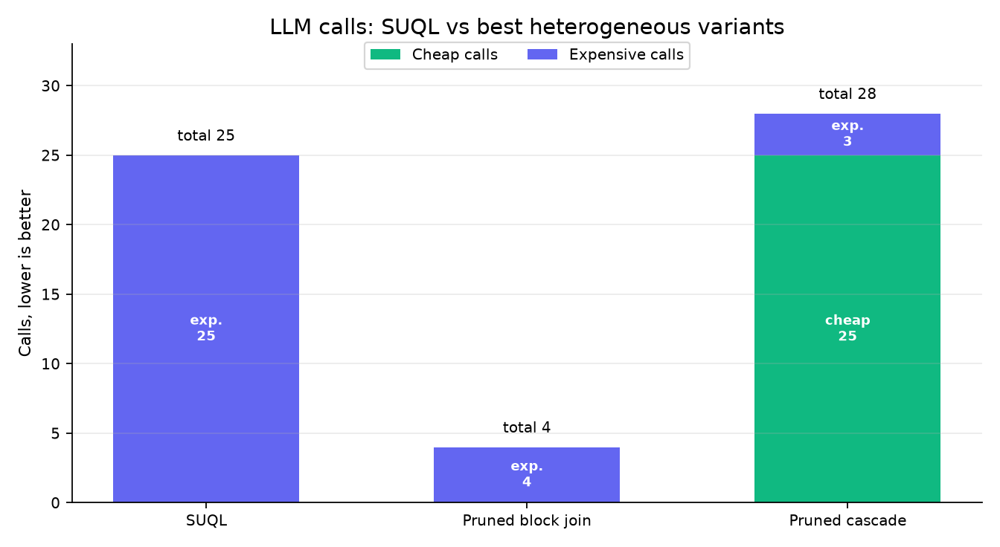

# Heterogeneous Question Answering over Structured and Unstructured Data using Large Language Models

Master 2 research workspace for comparing LLM-backed query execution over
structured IMDb metadata and unstructured movie reviews.

The retained work has three focuses:

1. SUQL structured-first execution: baseline, Stage 1 calibrated early exits,
   and Stage 2 cheap-to-expensive routing.
2. Semantic joins: Trummer heterogeneous block joins, structured pruning,
   row-wise cascades, and batched cascades on shared annotated data.
3. Benchmark suites for one-question comparisons, threshold sweeps, and
   multi-question difficulty scaling.

## Retained Systems

| System | Location | Execution strategy |
| --- | --- | --- |
| SUQL baseline | `project SUQL/src_baseline/` | Apply structured predicates first, then evaluate the semantic `answer()` predicate on surviving reviews. |
| SUQL Stage 1 | `project SUQL/src_baseline_stage1/`, `project SUQL/Stage_1/` | Score every candidate, accept or reject confident rows early, and use full generation for the ambiguous band. |
| SUQL Stage 2 | `project SUQL/src_baseline_stage2/`, `project SUQL/Stage_2/` | Use a cheap binary scorer and route uncertain candidates to an expensive full-answer model. |
| Trummer heterogeneous v1 | `project Trummer/heterogen_v1/` | Evaluate movie/review blocks with bounded semantic-join prompts and schema-constrained outputs. |
| Trummer heterogeneous v2 | `project Trummer/heterogen_v2/` | Generate exact-ID candidates, score them cheaply, and verify uncertain candidates with an expensive model. |
| Trummer heterogeneous v2_2 | `project Trummer/heterogen_v2_2/` | Prune year and exact movie/review IDs deterministically, then run Trummer block prompts for sentiment matching. |
| Trummer heterogeneous v2_3 | `project Trummer/heterogen_v2_3/` | Score exact-ID candidates in cheap batches and coalesce uncertain candidates into larger expensive batches. |
| Trummer heterogeneous v3 | `project Trummer/heterogen_v3/` | Combine structured pruning with the cheap-to-expensive cascade. |
| Trummer heterogeneous v3_2 | `project Trummer/heterogen_v3_2/` | Apply structured pruning first, then run the batched cheap-to-expensive cascade on the pruned exact-ID candidates. |

Stage 1 and Stage 2 are experimental physical operators inspired by calibrated
cascades and Stretto-style operator selection. They are not complete
implementations of the Stretto execution engine.

## Implementation Variants

The Trummer variants represent different physical plans for the same
movie-review semantic join:

| Variant | Structured pruning | Candidate unit | Cheap model use | Expensive model use |
| --- | --- | --- | --- | --- |
| V1 block join | None | Movie block x review block | None | Evaluates identity, year, and sentiment inside each block prompt. |
| V2 row-wise cascade | Exact `movie_id = tconst` join only | One movie-review pair | Scores every exact-ID pair independently. | Verifies uncertain pairs in fallback batches. |
| V2_2 structured-pruned block join | Question-derived movie filters plus exact review IDs | Pruned movie block x review block | None | Evaluates only the remaining semantic review predicate. |
| V2_3 batch-wise cascade | Exact `movie_id = tconst` join only | Batch of exact-ID pairs | Scores multiple pairs per cheap request. | Coalesces uncertain candidates into larger expensive batches. |
| V3 pruned cascade | Question-derived movie filters plus exact review IDs | Pruned exact-ID pair | Scores only candidates that survive structured pruning. | Verifies uncertain pruned candidates, capped by `--max-expensive-calls`. |
| V3_2 pruned batch-wise cascade | Question-derived movie filters plus exact review IDs | Batch of pruned exact-ID pairs | Scores only pruned candidates, grouped into cheap batches. | Coalesces uncertain pruned candidates into larger expensive batches. |

V2_2 and V3 use the structured predicate extractor from the newer heterogeneous
implementations. It maps question constraints onto the movie schema
(`movie_id`, `title`, `director`, `year`, `runtime`, and `genres`) and leaves
review sentiment or opinion matching to the LLM. V2_3 changes request
granularity rather than the predicate semantics: it keeps the same exact-ID
candidate set as V2, but reduces request overhead by classifying and verifying
batches. V3_2 combines the two later optimizations: it uses V3-style
structured pruning to reduce the candidate set, then runs the V2_3 batched
cascade over the remaining exact-ID movie/review pairs.

## Main Comparisons

### Trummer heterogeneous variants

`common_benchmark_v3/` compares the Trummer heterogeneous variants on the same
50-movie, 50-review dataset. The shared task requires:

1. movie year is 1998;
2. `movie_id = tconst`;
3. the review expresses a negative or strongly critical opinion.

The focused comparison below keeps only four model-use patterns:
cheap-only block join, expensive-only block join, row-wise cascading, and
batch-wise cascading. The cascade variants first create exact-ID candidates,
score them with the cheap model, and send uncertain candidates to the expensive
model. The batch-wise variant keeps the same logic but groups cheap scoring and
expensive fallback requests into batches.

The retained local plot set uses `qwen3:0.6b` as the cheap model and
`qwen3:1.7b` as the expensive model with 11 repetitions.

| Version | Wall time | Total LLM calls | Cheap calls | Expensive calls | Final rows | Precision | Recall | F1 |
| --- | ---: | ---: | ---: | ---: | ---: | ---: | ---: | ---: |
| Block join cheap | 11.84 s | 14 | 14 | 0 | 3.00 | 0.667 | 0.154 | 0.250 |
| Block join expensive | 24.00 s | 14 | 0 | 14 | 5.00 | 0.400 | 0.154 | 0.222 |
| Row-wise cascade | 33.56 s | 60 | 50 | 10 | 40.00 | 0.325 | 1.000 | 0.491 |
| Batch-wise cascade | 37.65 s | 10 | 7 | 3 | 36.00 | 0.333 | 0.923 | 0.490 |

The cheap-only block join is fastest, but it misses most true matches. The
expensive-only block join is slower and does not improve recall on this task,
which suggests that prompt shape and candidate construction matter as much as
model size. Row-wise cascading gives the best recall and the highest F1 among
these four variants, but it is call-heavy: 50 cheap calls plus 10 expensive
calls. Batch-wise cascading keeps almost the same F1 while reducing total calls
from 60 to 10. Its runtime is still high because the expensive fallback batches
dominate wall time.







Source metrics:
[`four_way_metrics.csv`](presentations/heterogen_four_way_plots/four_way_metrics.csv).

### SUQL baseline versus best heterogeneous variants

The last local qwen3 comparison keeps SUQL and the two strongest heterogeneous
plans: structured-pruning block join (V2_2) and structured-pruning cascade
(V3). SUQL and every expensive semantic stage use `qwen3:1.7b`; the structured
parser and cheap cascade stage use `qwen3:0.6b`. Each experiment is run 9 times
and numeric metrics are averaged.

| Version | Wall time | Total LLM calls | Cheap calls | Expensive calls | Final rows | Precision | Recall | F1 |
| --- | ---: | ---: | ---: | ---: | ---: | ---: | ---: | ---: |
| SUQL baseline | 148.37 s | 25 | 0 | 25 | 3.44 | 1.000 | 0.265 | 0.416 |
| Structured pruning block join | 8.33 s | 4 | 0 | 4 | 11.00 | 0.818 | 0.692 | 0.750 |
| Structured pruning cascade | 14.28 s | 28 | 25 | 3 | 24.00 | 0.542 | 1.000 | 0.703 |

SUQL is very precise in this run: the rows it returns are correct. Its weakness
is recall. It evaluates 25 reviews after the structured year filter but returns
only about 3.4 final rows on average, so it misses most of the 13 ground-truth
movies.

The structured-pruning block join is the best overall tradeoff. Deterministic
year and ID pruning reduces the semantic work to 4 expensive block calls, which
makes it much faster than SUQL while giving the highest F1. The structured
cascade gets perfect recall by first screening candidates with the cheap model
and sending only 3 calls to the expensive model, but it accepts more false
positives, so its precision and F1 are lower than V2_2.







Source metrics:
[`suql_vs_best_heterogen_qwen3.csv`](presentations/suql_vs_best_heterogen_qwen3/suql_vs_best_heterogen_qwen3.csv).

`common_benchmark/` retains the earlier 16-row multi-model comparison. It is
useful for model-sensitivity analysis, while `common_benchmark_v2/` is the
preferred mixed-year comparison because the Trummer predicate must enforce the
year condition itself.

### Threshold and multi-question suites

`common_benchmark_thresholds/` sweeps the cascade confidence threshold for V2
and V2_3. The newest saved run uses `qwen3:0.6b -> qwen3:1.7b` over thresholds
from `0` to `3`, averaged across 9 repetitions.


`common_benchmark_3q/` adds three 60-row movie-review questions with increasing
semantic difficulty. The retained aggregate plot compares SUQL, structured
pruned block join V2_2, and pruned cascade V3.


`common_benchmark_10q/` is the newest shared benchmark. It contains ten
disjoint 60-row movie-review questions. Every question has 24 structured
candidates and 12 ground-truth movie IDs, so no question has an empty target
set. The benchmark compares SUQL baseline, V2_3, V3, and V3_2 with quality
metrics, wall time, and cheap/expensive call counts. Each question/method pair
defaults to 11 repetitions, and the final `run_metrics.json`, comparison CSV,
aggregate CSV, summary, and plots use the mean across those repetitions.

V3_2 now lives as a standalone Trummer implementation under
`project Trummer/heterogen_v3_2/`. The common benchmark runners import it from
there instead of embedding V3_2-specific logic in the benchmark directory.

The Aker runner for this suite defaults to `gemma4:e2b` as the cheap model and
`gemma4:e4b` as the expensive model. It requests one GPU through OAR and refuses
to run unless the GPU is visible and Ollama appears in `nvidia-smi` for both
models.

Additional method-level documentation is available in
[`docs/implemented_methods.md`](docs/implemented_methods.md), with a compiled
textbook-style PDF at
[`docs/implemented_methods_textbook.pdf`](docs/implemented_methods_textbook.pdf).

## Experiment Suites

| Suite | Dataset and comparison | Use it for | Main runner | Primary outputs |
| --- | --- | --- | --- | --- |
| `common_benchmark/` | 16 unique movies for the 1998 negative-review task; SUQL baseline versus Trummer V1 block join. | Compact model-sensitivity runs across one non-cascading model at a time. | `python3 common_benchmark/scripts/run_all.py` | `comparison.csv`, `comparison.md`, `movie_id_outcomes.csv`, time and workload/quality plots, cross-model plots. |
| `common_benchmark_v2/` | 50 mixed-year movies for the same task; SUQL baseline versus Trummer V1 block join. | Preferred SUQL-vs-V1 test because Trummer must evaluate year, identity, and sentiment over all rows. | `python3 common_benchmark_v2/scripts/run_all.py` | `comparison.csv`, `comparison.md`, `movie_id_outcomes.csv`, time and workload/quality plots. |
| `common_benchmark_v3/` | Reuses the v2 50-row dataset; SUQL plus V1, V2, V2_2, V2_3, and V3. | Comparing physical semantic-join plans under one fixed question. | `python3 common_benchmark_v3/scripts/run_all.py` | `comparison.csv`, `comparison.md`, `movie_id_outcomes.csv`, focused quality/time/call plots. |
| `common_benchmark_v3/` all-Heterogen | Same v2 50-row dataset, but only V1, V2, V2_2, V2_3, and V3 with repetition averaging and Aker helpers. | Isolating Trummer heterogen variants without SUQL in the result set. | `python3 common_benchmark_v3/scripts/run_all_heterogen.py` | `all_metrics.csv`, `summary.md`, `experiment_config.json`, per-implementation `run_metrics_repetitions.csv`, focused plots. |
| `common_benchmark_thresholds/` | Same v3 one-question dataset; manual confidence-threshold sweep for V2 and V2_3. | Understanding how threshold choice changes quality, final rows, early decisions, and fallback load. | `python3 common_benchmark_thresholds/scripts/run_threshold_sweep.py` | `threshold_metrics.csv`, `summary.md`, quality-vs-threshold and final-rows plots. |
| `common_benchmark_3q/` | Three disjoint 60-row datasets with easy, medium, and hard semantic predicates; SUQL, V2_2, V2_3, and V3. | Testing robustness beyond the single 1998-negative-review task. | `python3 common_benchmark_3q/scripts/run_all.py` | Per-question run folders, `comparison.csv`, `aggregate.csv`, `comparison.png`. |
| `common_benchmark_10q/` | Ten disjoint 60-row datasets; each has 24 structured candidates and 12 ground-truth rows; SUQL, V2_3, V3, and V3_2 with 11-repetition averaging. | Current larger shared benchmark for quality, time, and call-count comparisons across question shapes. | `python3 common_benchmark_10q/scripts/run_all.py` | Per-question run folders, averaged `run_metrics.json`, `run_metrics_repetitions.csv`, `comparison.csv`, `aggregate.csv`, `summary.md`, quality/time/call plots. |

The benchmark runners preserve per-run artifacts rather than only aggregate
tables. Cascade runs keep `cascade_decisions.csv`; block-join runs keep
`joined_evidence.csv` and `join_stats.csv`; repeated runs keep
`run_metrics_repetitions.csv` next to the averaged `run_metrics.json`.

## SUQL Baseline, Stage 1, and Stage 2

The SUQL subproject now contains only the three retained execution strategies
and their supporting experiments.

### Baseline

The baseline applies ordinary SQL-compatible predicates before semantic review
evaluation. This reduces the number of rows sent to the LLM and provides the
reference behavior for Stage 1 and Stage 2.

### Stage 1

Stage 1 adds a calibrated scorer before full generation:

```text
score >= accept threshold  -> Yes
score <= reject threshold  -> No
otherwise                  -> full answer() call
```

Its benefit depends on scorer cost and the fraction of candidates decided
early. Ambiguous candidates pay for both scoring and full generation.


### Stage 2

Stage 2 separates the cheap scorer from the expensive answer model. It can
reject, accept, skip cheap scoring when observed yield is too low, or fall back
to the expensive model. Results must therefore be interpreted using cheap
calls, early decisions, skips, and expensive calls—not wall time alone.

Retained Stage 2 experiments are under `project SUQL/Stage_2/benchmarks/`.

## Repository Structure

```text
.
├── project SUQL/
│   ├── src_baseline/             # structured-first reference engine
│   ├── src_baseline_stage1/      # calibrated early-exit engine
│   ├── src_baseline_stage2/      # cheap-to-expensive cascade engine
│   ├── Stage_1/                  # calibration and baseline-vs-Stage-1 experiments
│   ├── Stage_2/                  # cascade and baseline-vs-Stage-2 experiments
│   ├── data/                     # local IMDb data preparation
│   ├── data_samples/             # deterministic benchmark samples
│   └── scripts/                  # retained Stage 1/Stage 2 analysis and Aker runners
├── project Trummer/
│   ├── baseline/                 # paper-style semantic join reproduction
│   ├── heterogen_v1/             # bounded block semantic join
│   ├── heterogen_v2/             # pair-level exact-ID cascade semantic join
│   ├── heterogen_v2_2/           # structured-pruned bounded block semantic join
│   ├── heterogen_v2_3/           # batched exact-ID cascade semantic join
│   ├── heterogen_v3/             # structured-pruned cascade semantic join
│   └── heterogen_v3_2/           # structured-pruned batched cascade semantic join
├── common_benchmark/             # legacy SUQL baseline vs v1 model sweep
├── common_benchmark_v2/          # mixed-year SUQL baseline vs fixed-output v1
├── common_benchmark_v3/          # one-question heterogen implementation comparison
├── common_benchmark_thresholds/   # cascade-threshold sweep
├── common_benchmark_3q/           # three-question difficulty benchmark
├── common_benchmark_10q/          # ten-question SUQL/V2_3/V3/V3_2 benchmark
├── docs/                         # implemented-method notes and compiled PDF
├── presentations/                # final project and paper-review slides
└── papers/                       # local reading material, not tracked
```

## Setup

Requirements:

- Python 3.11 or newer;
- Ollama;
- enough memory for the selected local model;
- IMDb-derived data files for full SUQL experiments.

```bash
cd "/path/to/lab m2"
python3 -m venv .venv
source .venv/bin/activate
pip install -r "project SUQL/requirements.txt"
pip install -r common_benchmark_v3/requirements.txt
```

Install representative models:

```bash
ollama pull qwen3:0.6b
ollama pull qwen3:1.7b
ollama pull qwen2.5:3b
ollama pull gemma4:e2b
ollama pull gemma4:e4b
```

Configure the local endpoint:

```bash
export SUQL_API_BASE="http://127.0.0.1:11434"
export SUQL_MODEL="ollama/qwen3:1.7b"
export SUQL_CHEAP_MODEL="ollama/qwen3:0.6b"
export SUQL_EXPENSIVE_MODEL="ollama/qwen3:1.7b"
```

## Running SUQL Experiments

Run the baseline:

```bash
cd "project SUQL/src_baseline"
python ../scripts/run_suql.py --engine-dir . \
  "Which horror movies under 110 minutes have reviews mentioning suspense or tension?"
```

Run baseline versus Stage 1:

```bash
cd "project SUQL"
python Stage_1/benchmark_stage1.py \
  --sample-size 100 \
  --model ollama/phi4-mini \
  --api-base "$SUQL_API_BASE"
```

Run baseline versus Stage 2:

```bash
cd "project SUQL"
python Stage_2/benchmark_stage2.py \
  --sample-size 100 \
  --seed 11 \
  --api-base "$SUQL_API_BASE" \
  --model "$SUQL_EXPENSIVE_MODEL" \
  --cheap-model "$SUQL_CHEAP_MODEL"
```

Stage 1 and Stage 2 thresholds are model-specific. Recalibrate them after
changing the scorer model, prompt, or data distribution.

## Running Shared Comparisons

Run SUQL baseline versus Trummer heterogeneous v1:

```bash
cd "/path/to/lab m2"
"project SUQL/.venv/bin/python" common_benchmark_v2/scripts/run_all.py \
  --api-base "$SUQL_API_BASE" \
  --model ollama/qwen2.5:3b \
  --skip-build-dataset
```

Run the Trummer heterogeneous variants:

```bash
python3 -m unittest discover -s common_benchmark_v3/tests -v

python3 common_benchmark_v3/scripts/run_all_heterogen.py \
  --api-base "$SUQL_API_BASE" \
  --cheap-model "$SUQL_CHEAP_MODEL" \
  --expensive-model "$SUQL_EXPENSIVE_MODEL" \
  --repetitions 9
```

Run SUQL plus the heterogen variants on the same one-question benchmark:

```bash
python3 common_benchmark_v3/scripts/run_all.py \
  --api-base "$SUQL_API_BASE" \
  --cheap-model "$SUQL_CHEAP_MODEL" \
  --expensive-model "$SUQL_EXPENSIVE_MODEL" \
  --repetitions 9
```

Run the threshold sweep for V2 and V2_3:

```bash
python3 common_benchmark_thresholds/scripts/run_threshold_sweep.py \
  --api-base "$SUQL_API_BASE" \
  --cheap-model "$SUQL_CHEAP_MODEL" \
  --expensive-model "$SUQL_EXPENSIVE_MODEL" \
  --thresholds 0,0.5,1,1.5,2,2.5,3 \
  --repetitions 9
```

Run the three-question suite:

```bash
python3 common_benchmark_3q/scripts/run_all.py \
  --api-base "$SUQL_API_BASE" \
  --cheap-model "$SUQL_CHEAP_MODEL" \
  --expensive-model "$SUQL_EXPENSIVE_MODEL" \
  --output-dir outputs/qwen3_current
```

Run the ten-question suite locally:

```bash
python3 common_benchmark_10q/scripts/build_datasets.py
python3 -m unittest discover -s common_benchmark_10q/tests -v

bash common_benchmark_10q/scripts/runner.sh local \
  --api-base "$SUQL_API_BASE" \
  --cheap-model gemma4:e2b \
  --expensive-model gemma4:e4b \
  --repetitions 11 \
  --output-dir outputs/local_gemma4_e2b_e4b_10q_11reps
```

Run the ten-question suite on Aker:

```bash
# Local Mac
bash common_benchmark_10q/scripts/sync_common_benchmark_10q_to_aker.sh

# Aker login node
cd /home/daisy/remizova/common_benchmark_10q_workspace
PULL_MODELS=1 bash common_benchmark_10q/scripts/runner.sh submit-aker
```

The Aker worker defaults to `REQUIRE_GPU=1`. It stops before the benchmark if
it is not inside an OAR allocation, if `nvidia-smi` cannot see a GPU, or if
Ollama does not appear in the GPU compute-app list while loading both
`gemma4:e2b` and `gemma4:e4b`.

The common benchmark suites contain local execution scripts and, where needed,
Aker synchronization and OAR submission helpers. See each suite README for the
exact workflow, monitoring commands, and output contract.

## Reading Results

- Do not compare dry-run metrics with real LLM runs.
- Use metrics sidecars when scorer calls are separate from engine logs.
- Count cheap scoring, expensive fallback, and downstream work.
- Compare retrieval quality together with prompts and wall time.
- Treat saved results as specific to their dataset, prompt, model, threshold,
  and hardware configuration.

## References

The project uses the following literature as design and comparison context.
Local PDF copies may exist under `papers/`, but that directory is intentionally
not tracked in Git.

| Work | Used for | Link |
| --- | --- | --- |
| Shicheng Liu, Jialiang Xu, Wesley Tjangnaka, Sina Semnani, Chen Yu, and Monica Lam. *SUQL: Conversational Search over Structured and Unstructured Data with Large Language Models*. Findings of NAACL 2024. | Structured-first query execution, `answer()`/`summary()` semantics, and the SUQL baseline. | <https://aclanthology.org/2024.findings-naacl.283/> |
| Immanuel Trummer. *Implementing Semantic Join Operators Efficiently*. arXiv:2510.08489. | Tuple, block, and adaptive semantic-join execution plans; basis for Trummer baseline and heterogeneous block joins. | <https://arxiv.org/abs/2510.08489> |
| Gabriele Sanmartino, Matthias Urban, Paolo Papotti, and Carsten Binnig. *The Stretto Execution Engine for LLM-Augmented Data Systems*. arXiv:2602.04430. | Physical-operator selection, runtime-quality tradeoffs, and error-budget/cascade framing for Stage 1, Stage 2, and heterogen cascades. | <https://arxiv.org/abs/2602.04430> |
| Matthias Urban and Carsten Binnig. *ELEET: Efficient Learned Query Execution over Text and Tables*. arXiv:2410.22522. | Learned query execution over mixed text/table data and comparison point for non-LLM or smaller-model execution. | <https://arxiv.org/abs/2410.22522> |
| Xuanhe Zhou, Junxuan He, Wei Zhou, Haodong Chen, Zirui Tang, Haoyu Zhao, Xin Tong, Guoliang Li, Youmin Chen, Jun Zhou, Zhaojun Sun, Binyuan Hui, Shuo Wang, Conghui He, Zhiyuan Liu, Jingren Zhou, and Fan Wu. *A Survey of LLM x DATA*. arXiv:2505.18458. | Broader LLM4Data/Data4LLM taxonomy used in presentation and project positioning. | <https://arxiv.org/abs/2505.18458> |

Additional source material:

- SUQL implementation reference: <https://github.com/stanford-oval/suql>.
- Trummer semantic-join implementation reference and IMDb review sample:
  <https://github.com/itrummer/llmjoins>.
- IMDb 50K review dataset cited by the Trummer baseline data provenance:
  <https://www.kaggle.com/datasets/atulanandjha/imdb-50k-movie-reviews-test-your-bert>.
