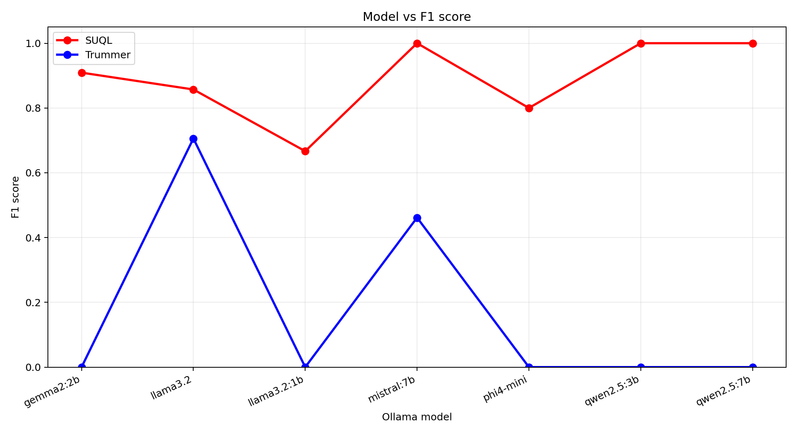
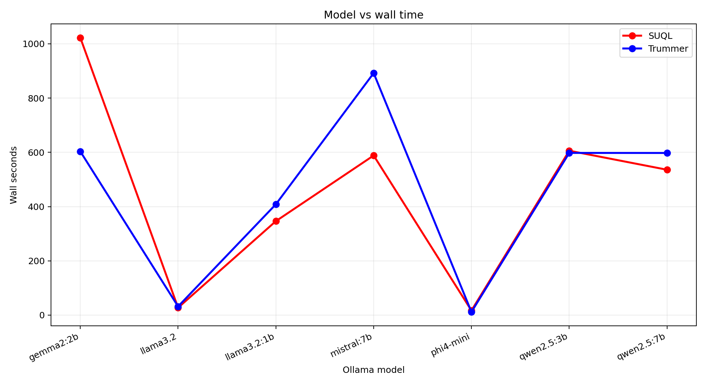
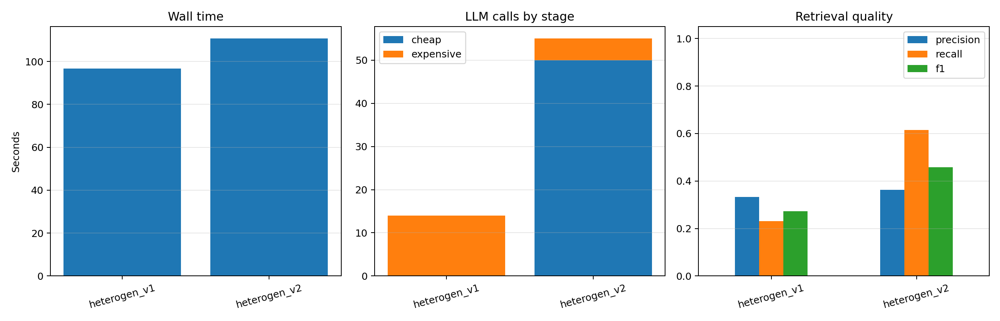

# LLM-Augmented Movie Retrieval and Semantic Join Experiments

Master 2 research workspace for evaluating query execution over structured IMDb
metadata and unstructured movie reviews.

The project studies when an LLM should be used as a semantic database operator,
how candidate generation changes execution cost, and whether calibrated
cheap-to-expensive cascades can preserve retrieval quality while reducing
expensive model calls.

## Research Questions

- How does structured-first SUQL execution compare with independent semantic
  retrieval followed by an online join?
- Can a calibrated scorer make early `Yes`/`No` decisions before a full
  `answer()` generation?
- When does a cheap-to-expensive model cascade reduce total work?
- How do SUQL-style filtering and Trummer-style semantic joins compare on the
  same annotated rows?
- Which effects come from the execution strategy, and which come from the
  selected local model?

## Approaches

| Approach | Location | Main idea |
| --- | --- | --- |
| SUQL baseline | `project SUQL/src_baseline/` | Apply structured SQL predicates first, then run LLM-backed `answer()` only on surviving review rows. |
| SUQL online join | `project SUQL/src_online_join/` | Retrieve structured and semantic results separately, then join them by movie identifier. |
| Stage 1 | `project SUQL/src_baseline_stage1/`, `project SUQL/Stage_1/` | Score each candidate with calibrated binary log-odds; accept/reject confident rows and use full generation for the ambiguous band. |
| Stage 2 | `project SUQL/src_baseline_stage2/`, `project SUQL/Stage_2/` | Route candidates through a cheap model and fall back to an expensive model only when needed. |
| Trummer baseline | `project Trummer/baseline/` | Reproduce tuple, block, and adaptive semantic joins from the LLM join literature. |
| Trummer heterogeneous v1 | `project Trummer/heterogen_v1/` | Use structured candidate restrictions followed by a bounded block semantic join. |
| Trummer heterogeneous v2 | `project Trummer/heterogen_v2/` | Exact-ID candidate generation followed by a cheap-to-expensive semantic cascade. |

Stage 1 and Stage 2 are experimental physical operators inspired by calibrated
cascades and Stretto-like operator selection. They are not full
implementations of the Stretto execution engine.

## Repository Structure

```text
.
├── project SUQL/
│   ├── src_baseline/             # structured-first SUQL engine
│   ├── src_online_join/          # independent retrieval + online join
│   ├── src_baseline_stage1/      # baseline engine with calibrated early exits
│   ├── src_baseline_stage2/      # baseline engine with model cascade
│   ├── Stage_1/                  # calibration, thresholds, and Stage 1 benchmarks
│   ├── Stage_2/                  # cascade, profiling, and Stage 2 benchmarks
│   ├── scripts/                  # local/Aker runners and plot generation
│   ├── benchmarks/               # retained metrics and experiment plots
│   └── docs/                     # analysis, figures, and presentation sources
├── project Trummer/
│   ├── baseline/                 # paper-style semantic join reproduction
│   ├── heterogen_v1/             # bounded block join for movie/review tables
│   └── heterogen_v2/             # exact-ID + cascading semantic join
├── common_benchmark/             # SUQL baseline vs Trummer v1, multi-model
├── common_benchmark_v2/          # deterministic mixed-year benchmark variant
├── common_benchmark_v3/          # Trummer v1 vs v2 cascade benchmark
├── presentations/                # project and paper-review slide decks
└── papers/                       # local reading material; intentionally not tracked
```

Large IMDb tables, Python environments, model logs, OAR logs, and generated
cache files are intentionally excluded from Git.

## Models

All current execution paths use an Ollama-compatible local endpoint through
LiteLLM or the OpenAI-compatible HTTP API.

| Use | Current default / evaluated models |
| --- | --- |
| SUQL baseline and online join | `gemma2:2b` in the current Aker comparison runner; older experiments also use `phi4-mini`. |
| Stage 1 scorer and fallback | `phi4-mini` by default. The scorer requires usable `1`/`0` token log probabilities. |
| Stage 2 cheap scorer | `gemma2:2b` by default; experiments also include `llama3.2:1b`. |
| Stage 2 expensive fallback | `phi4-mini` by default. |
| Trummer heterogeneous v1 | One full model, commonly `qwen2.5:3b`, `phi4-mini`, `gemma2:2b`, or another model in the sweep. |
| Trummer heterogeneous v2 | `gemma2:2b` cheap model and `qwen2.5:3b` expensive model by default. |
| Common benchmark model sweep | `gemma2:2b`, `llama3.2` variants, `mistral:7b`, `qwen2.5` variants, and `phi4-mini`. |

Model names may be supplied as Ollama tags (`gemma2:2b`) or LiteLLM provider
names (`ollama/gemma2:2b`) where the runner supports normalization.
Thresholds are model-specific and should be recalibrated after changing the
cheap scorer.

## Current Results

These plots are retained experiment artifacts, not claims that one strategy is
universally best. Compare quality, total prompts, expensive calls, candidate
counts, and wall time together.

### Cross-system SUQL summary


### Baseline vs online join at sample size 200

The saved `gemma2:2b` run shows the structured-first baseline using fewer
prompts and less wall time for this workload. Online join scans semantic rows
independently, so it can perform substantially more LLM work.


### Stage 1 scaling

Stage 1 adds a scorer call before possible fallback. It helps only when scoring
is materially cheaper than full generation and confident early decisions are
frequent enough to repay that overhead.


### SUQL vs Trummer across models

On the retained annotated common benchmark, SUQL produced non-empty results for
all seven tested models and had higher mean F1. Trummer v1 was highly sensitive
to model output and parsing behavior.





### Trummer block join vs cascade

The v3 benchmark compares bounded block joining with exact-ID candidates plus
a cheap-to-expensive cascade. The cascade improved recall and F1 with
`llama3.2 -> qwen2.5:3b` in the saved run, but required more total calls and
slightly more wall time.



## Setup

Prerequisites:

- Python 3.11 or newer
- Ollama
- enough memory for the selected model
- IMDb-derived data files for full SUQL experiments

Create one environment for the workspace:

```bash
cd "/path/to/lab m2"
python3 -m venv .venv
source .venv/bin/activate
pip install -r "project SUQL/requirements.txt"
pip install -r common_benchmark_v3/requirements.txt
```

Start Ollama and install the common default models:

```bash
ollama serve
ollama pull gemma2:2b
ollama pull phi4-mini
ollama pull qwen2.5:3b
```

Set the endpoint and model configuration:

```bash
export SUQL_API_BASE="http://127.0.0.1:11434"
export SUQL_MODEL="ollama/phi4-mini"
export SUQL_CHEAP_MODEL="ollama/gemma2:2b"
export SUQL_EXPENSIVE_MODEL="ollama/phi4-mini"
```

## Data

Full SUQL runs expect these local files under `project SUQL/data/`:

```text
imdb_joined.csv
imdb_reviews.csv
imdb_structured_joined.csv
name.basics.tsv
title.basics.tsv
title.crew.tsv
```

They are not included because they are large. The common benchmark directories
contain small annotated datasets suitable for validating the experiment
pipeline.

## Running the Project

### Run a SUQL query

```bash
cd "project SUQL/src_baseline"
python main.py \
  "Which horror movies under 110 minutes have reviews mentioning suspense or tension?"
```

Run the same style of query with the online-join engine:

```bash
cd "project SUQL/src_online_join"
python main.py \
  "Which science fiction movies have reviews praising imagination or effects?"
```

### Compare baseline and online join

From `project SUQL/`:

```bash
python scripts/benchmark_compare.py \
  --sample-size 200 \
  --model ollama/gemma2:2b
```

### Run Stage 1

```bash
cd "project SUQL"
python Stage_1/benchmark_stage1.py \
  --sample-size 100 \
  --model ollama/phi4-mini \
  --api-base "$SUQL_API_BASE"
```

Calibration data must contain `review`, `question`, and `label` columns:

```bash
python Stage_1/calibrate.py labelled_examples.csv \
  --output Stage_1/thresholds.json
```

### Run Stage 2

```bash
cd "project SUQL"
python Stage_2/benchmark_stage2.py \
  --sample-size 100 \
  --seed 11 \
  --api-base "$SUQL_API_BASE" \
  --model "$SUQL_EXPENSIVE_MODEL" \
  --cheap-model "$SUQL_CHEAP_MODEL"
```

### Run the shared SUQL vs Trummer benchmark

```bash
cd "/path/to/lab m2"
python common_benchmark/scripts/run_all.py \
  --api-base "$SUQL_API_BASE" \
  --model ollama/gemma2:2b
```

Validate the pipeline without model calls:

```bash
python common_benchmark/scripts/run_all.py --dry-run
```

### Run Trummer v1 vs cascade v2

```bash
python -m unittest discover -s common_benchmark_v3/tests -v

python common_benchmark_v3/scripts/run_all.py \
  --api-base "$SUQL_API_BASE" \
  --cheap-model ollama/gemma2:2b \
  --expensive-model ollama/qwen2.5:3b
```

Results are written under:

```text
common_benchmark_v3/outputs/cheap_<cheap>__expensive_<expensive>/
```

## Aker GPU Execution

Each common benchmark contains scripts for syncing, submitting an OAR job,
monitoring it, and pulling artifacts back. For v3:

```bash
# Local machine
bash common_benchmark_v3/scripts/sync_common_benchmark_to_aker.sh

# Aker login node
cd /home/daisy/remizova/common_benchmark_v3_workspace
CHEAP_MODEL=gemma2:2b \
EXPENSIVE_MODELS="qwen2.5:3b" \
PULL_MODELS=1 \
bash common_benchmark_v3/scripts/submit_aker_common_benchmark.sh

# Monitor
oarstat -u "$USER"
oarstat -f -j <jobid>
tail -F common_benchmark_v3/logs/oar_<jobid>.out

# Local machine after completion
bash common_benchmark_v3/scripts/pull_common_benchmark_from_aker.sh
```

See the README inside each benchmark directory for its exact data contract,
output schema, retry procedure, and remote paths.

## Reading Results Correctly

- Use `llm_prompts_issued` or metrics sidecars when scorer calls are separate
  from engine logs.
- Count cheap scoring, expensive fallback, and downstream summarization work.
- Treat a faster run as useful only after checking result quality and route
  counts.
- Do not compare dry-run metrics with real LLM runs.
- Recalibrate thresholds when the model, prompt, or data distribution changes.

## References

- Liu et al., *SUQL: Conversational Search over Structured and Unstructured
  Data with Large Language Models*.
- Trummer et al., *Implementing Semantic Join Operators Efficiently*.
- The Stretto execution-engine work on physical operators for LLM-augmented
  data systems.

This repository is an academic experiment workspace. Saved results describe
specific datasets, prompts, models, thresholds, and hardware; they should not
be generalized without rerunning the benchmark.
