# Cost-Bounded Cascaded Semantic Query Execution

A benchmark of four ways to answer natural-language questions that mix a
**structured predicate** (year, price, genre, brand, ...) with a **semantic
predicate** judged from free text (a review, a plot summary) — evaluated
identically on two unrelated domains, **IMDb movies** and **Amazon Fashion
product reviews**. This is the code, data, and results behind an EDBT 2027
submission ([`docs/edbt2027-paper/main.pdf`](docs/edbt2027-paper/main.pdf)) and
a MOSIG report ([`docs/mosig-report/main.pdf`](docs/mosig-report/main.pdf)).

> **Headline result.** Structured pushdown (SQL/SQLite before any LLM call) is
> the dominant cost lever, not model strength. Layering a calibrated
> cheap→expensive cascade on top of a **batched** semantic join
> (`trummer_v1`) is the best cost/quality trade-off on both datasets when it
> works — but it is not yet reliable across model families on IMDb (§5). A
> cascade on top of a **row-wise** judge (`suql_v1`) is structurally
> disadvantaged: its "cheap" stage pays full prompt-prefill cost per row, so
> it trades time, not calls, for a small quality gain.

---

## Table of contents

0. [Repository layout](#0-repository-layout)
1. [Datasets](#1-datasets)
2. [The four methods](#2-the-four-methods)
3. [Architecture: pipelines, prompts, semantic dictionary, cascade calibration](#3-architecture-pipelines-prompts-semantic-dictionary-cascade-calibration)
4. [Headline experiment results](#4-headline-experiment-results)
5. [Analysis: what actually explains these numbers](#5-analysis-what-actually-explains-these-numbers)
6. [Setup and running](#6-setup-and-running)

---

## 0. Repository layout

Two self-contained dataset trees (`imdb/`, `amazon/`) share the same four
method implementations, the same suite/runner scripts, and the same output
schema, so results are directly comparable across domains.

```text
lab-m2/
├── README.md                    this file
├── docs/
│   ├── edbt2027-paper/          EDBT 2027 submission (LaTeX, figures, main.pdf)
│   ├── mosig-report/            MOSIG report (LaTeX, figures, main.pdf)
│   ├── papers/                  reference papers (SUQL, ELEET, Stretto, ...)
│   ├── presentations/           slide decks from project milestones
│   └── eda/                     dataset ETL plots + scripts backing §1 below
│       ├── imdb/                 generate_plots.py + 4 PNGs
│       └── amazon/               generate_plots.py + 4 PNGs
│
├── imdb/
│   ├── data/
│   │   ├── sources/              downloaded title.basics/title.crew/name.basics + review split
│   │   ├── canonical/            reconstructed structured + review tables (§1)
│   │   ├── benchmark_union/       deduplicated union of all benchmark records
│   │   └── subdatasets/<suite>/   per-question CSVs, annotations, ground truth
│   ├── approaches/
│   │   ├── project SUQL/{baseline,v1}/      suql_baseline, suql_v1 (§2-3)
│   │   └── project Trummer/{baseline,v1}/   trummer_baseline, trummer_v1 (§2-3)
│   ├── benchmarks/
│   │   ├── {1q,3q,5q,10q}/        suite definitions + outputs
│   │   ├── shared/scripts/         run_method.py, evaluate_and_plot.py, common.py, ...
│   │   ├── semantic_dict/          the semantic-dictionary miner (§3)
│   │   └── multi_model_experiments/  cross-model-pair result summaries (§4)
│   └── experiments/imdb_5q_10rep/   4 model-pair runs (§4)
│
├── amazon/
│   ├── products.csv, reviews.json, *.json.gz   raw McAuley-Lab source
│   ├── canonical/                 structured.csv, texts.csv, schema.json (§1)
│   ├── approaches/                 ported copy of imdb/approaches/ (Amazon schema, §2-3)
│   ├── benchmarks/
│   │   ├── {1q,3q,5q,10q}/          suite definitions + outputs
│   │   ├── scaling/                 candidate-pool-size scaling study (§4)
│   │   └── shared/scripts/          symlinked/mirrored from imdb/benchmarks/shared
│   ├── experiments/
│   │   ├── amazon_5q_10rep/          4 model-pair runs (§4)
│   │   └── seed_verification/        reliability check for repetition variance (§5)
│   └── archive_generalized_pipeline_results/  pre-port results — NOT comparable, see §4
```

**A note on staleness.** `imdb/benchmarks/README.md` and `amazon/README.md`
are narrower, per-directory docs and in places point at superseded run
directories (the Amazon side in particular still describes the deleted
`generalized_pipeline/` implementation). Treat **this file** as the
canonical source for headline numbers; §4 explains which runs are current and
which are archived.

---

## 1. Datasets

Both datasets are reduced to the same shape before benchmarking: a
**structured table** (one row per entity) and a **free-text table** (one or
more text rows per entity, joined on an ID), then cut into per-question
**candidate pools** with a controlled structured/semantic/ground-truth mix
(§3). The plots below are full-corpus ETL statistics computed directly from
the canonical tables (`docs/eda/{imdb,amazon}/generate_plots.py`), not from
any one benchmark run.

### 1.1 IMDb

Reconstructed from `title.basics`, `title.crew`, and `name.basics` (structured
metadata) joined against the Stanford/IMDb-ID sentiment train split (reviews),
using preprocessing recovered from a specific pinned git commit — see
[`imdb/data/canonical/provenance.json`](imdb/data/canonical/provenance.json)
for exact source URLs, checksums, and the snapshot caveat.

| Table | Rows | Columns |
|---|---|---|
| `canonical/imdb_structured.csv` | 431,917 movies | `movie_id, title, director, year, runtime, genres` |
| `canonical/imdb_reviews.csv` | 25,000 reviews | `tconst, review, score, label` |
| `canonical/imdb_joined.csv` | 25,000 rows | structured ⋈ reviews on `movie_id = tconst` |

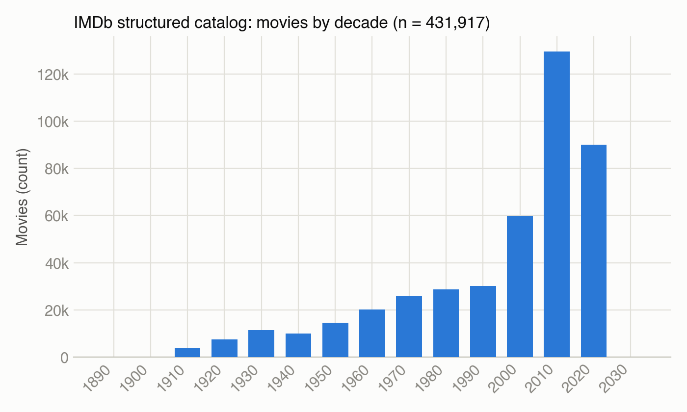

The catalog spans 1894–2030 (a small number of forward-dated placeholder
entries) and skews heavily toward 2010s content (>130k movies). 194,169
unique directors appear across the catalog — the vast majority direct a
single film.

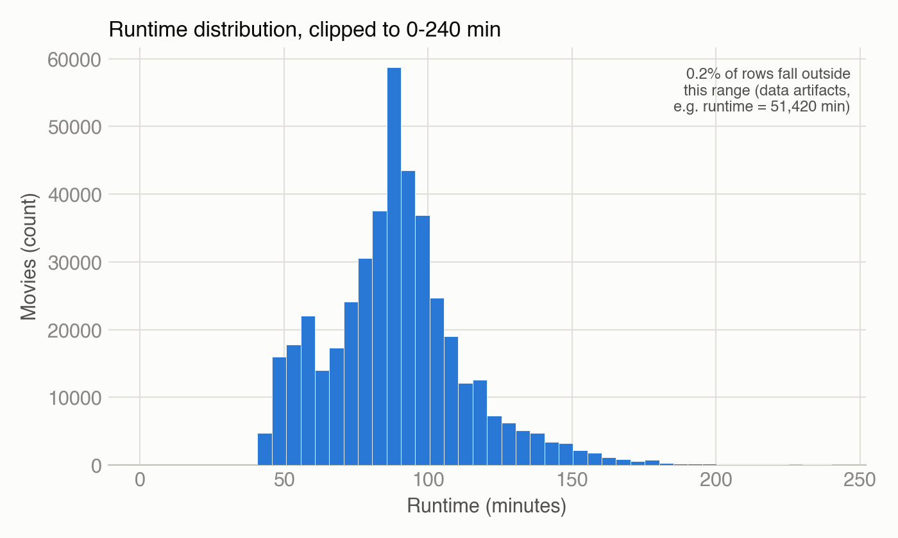

Median runtime is 89 minutes; 0.2% of rows are data artifacts (e.g. a
recorded runtime of 51,420 minutes), clipped out of the histogram above.

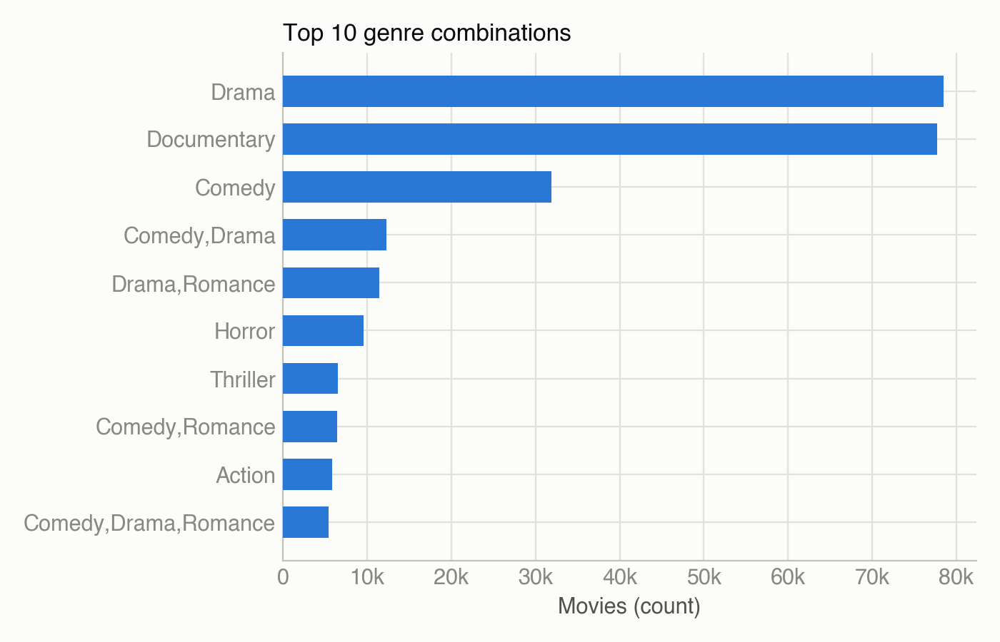

Drama and Documentary dominate as single-label genres; most multi-genre
combinations pair Comedy, Drama, or Romance.

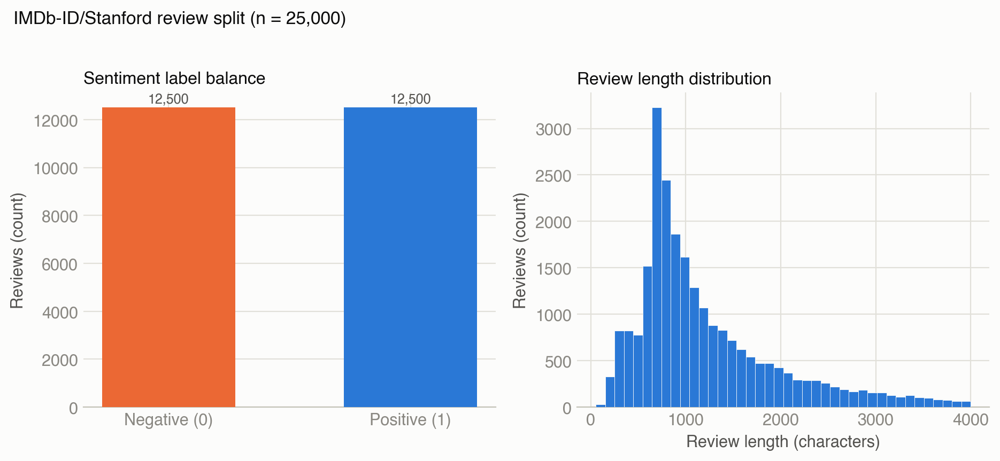

The 25,000-review sentiment split is perfectly balanced (12,500 positive /
12,500 negative) by construction, and — a detail worth knowing before reading
`score` as continuous — **only scores 1–4 and 7–10 occur**; scores 5 and 6
(neutral) are excluded from the source split entirely. Median review length
is 979 characters, an order of magnitude longer than Amazon's reviews below.

**From corpus to benchmark suites.** `imdb/benchmarks/build_suites.py` and
`build_catalog.py` cut this corpus into the `1q/3q/5q/10q` suites used
everywhere else in this repo: every question gets its own 100-candidate pool
(40 satisfy the structured predicate, 12 are ground truth), with a
per-candidate `annotations.csv` recording the structured/semantic label
derivation, evidence excerpt, and rationale — metadata only, never read by
the implementations under test (`imdb/data/README.md`,
`imdb/benchmarks/README.md`).

### 1.2 Amazon Fashion

Source: the 2018 McAuley Lab **Amazon Fashion** release, full category (not
its 5-core subset, which has only 31 products — too few to guarantee 10+
ground-truth matches per held-out question).

| Table | Rows | Columns |
|---|---|---|
| `canonical/structured.csv` | 186,105 products | `product_id, title, brand, category, price, description, features, sales_rank` |
| `canonical/texts.csv` | 882,321 reviews | `review_id, product_id, review_text, summary, rating, helpfulness, verified, review_time` |

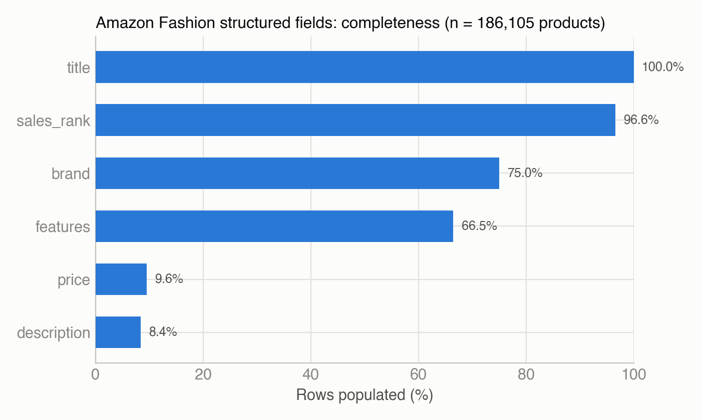

This is the dataset's central ETL finding: **structured metadata is sparse**.
`title` and `sales_rank` are essentially complete, but `price` is populated
for under 10% of products and `description` for under 9%; the `category`
column is **100% empty** in this release — category signal instead lives
inside the free-text `sales_rank` field (e.g.
`"13,052,976inClothing,Shoesamp;Jewelry("`), which the benchmark's structured
parser has to extract rather than read directly.

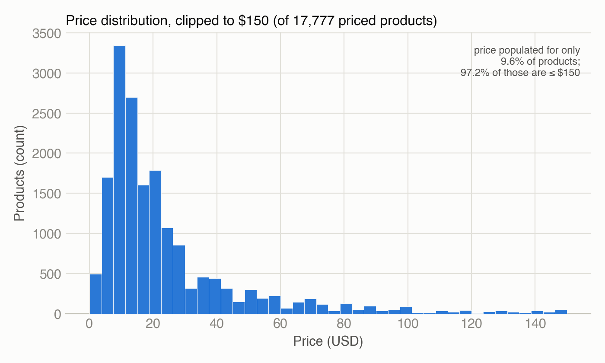

Among the ~18k products with a parseable price, the median is $16.49 (mean
$37.24, pulled up by a long tail to $69,995) — the histogram above clips to
$150 to keep the bulk of the distribution readable.

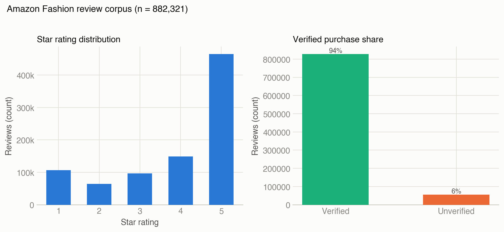

Ratings skew strongly positive (5-star is 52.6% of all reviews), and 94% of
reviews are from verified purchases.

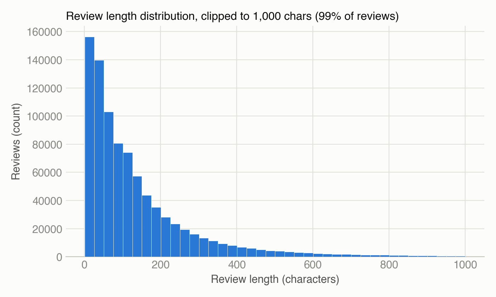

Median review length is **88 characters** — roughly 1/11th of IMDb's median
review — because these are short product-feedback snippets, not long-form
critique. This difference matters for the semantic judge: it sees far less
per-item evidence on Amazon than on IMDb.

**From corpus to benchmark suites.** `amazon/benchmarks/build_subdatasets.py`
applies the same 100-candidate-pool design as IMDb, driven by frozen,
reviewed questions in `amazon/questions_10q.json`. Both tables also carry a
stable, stratified **70/30 dictionary/evaluation split** (`_split` column:
130,063/56,042 products, 619,639/262,682 reviews) — the same "mine on one
slice, never read the other's raw text again" discipline used by the IMDb
semantic dictionary (§3), applied here at the corpus level so held-out
questions can't leak into whatever process built the benchmark pools.

---

## 2. The four methods

Every question is answered by combining a **structured filter** (SQL/SQLite,
free) with a **semantic filter** (an LLM judging free text). The four methods
are two baseline execution strategies for the semantic filter, plus a
cascaded variant of each:

| Flag | Structured pushdown? | Semantic execution | LLM tiers used |
|---|---|---|---|
| `suql_baseline` | Yes | One `answer()` call **per row** | expensive only |
| `suql_v1` | Yes | Cheap logprob-scored pre-pass, ambiguous rows escalate to `answer()` | cheap + expensive |
| `trummer_baseline` | **No** | Batched block-pair join, predicate applied inside the join call | expensive only |
| `trummer_v1` | Yes (added in v1) | Batched cheap YES/NO/UNCERTAIN pass, `UNCERTAIN`/low-confidence batches re-verified expensively | cheap + expensive |

`trummer_baseline` is the only method with no structured pushdown at all —
by design, to isolate what pushdown alone is worth once `trummer_v1` adds it
back (§5). Both `v1` variants add the same two-level **cascade** idea; they
differ in whether the cheap stage is row-wise (`suql_v1`, batch size 1) or
batched (`trummer_v1`, batch size 8) — a difference that turns out to
determine whether cascading helps or hurts (§3, §5).

`amazon/approaches/` is a line-by-line port of `imdb/approaches/` with the
domain rewritten (schema, few-shot examples, structured-predicate vocabulary,
judging prompts) — the two trees evolve independently; a change to one is
not a change to the other.

---

## 3. Architecture: pipelines, prompts, semantic dictionary, cascade calibration

### 3.1 Pipelines

**`suql_baseline`** ([`suql_engine.py`](<imdb/approaches/project SUQL/baseline/suql_engine.py>)):
one expensive-LLM call parses the NL question into a SUQL string (SQL +
`answer()`/`summary()` predicates); the SQL part runs for free against an
in-memory SQLite table; every surviving row gets exactly one expensive
`answer()` call, no batching.


```mermaid
flowchart LR
    Q[NL question] --> P["NL → SUQL parse<br/>(expensive LLM, few-shot)"]
    P --> S["Structured filter<br/>(SQLite, no LLM)"]
    S --> A["answer() per row<br/>(expensive LLM, 1 call/row)"]
    A --> R[Result set]
```

**`suql_v1`** ([`cascade_filter.py`](<imdb/approaches/project SUQL/v1/cascade_filter.py>)):
identical NL→SQL parse and structured filter; the difference is entirely in
how `answer()` is executed — via a cascade instead of a direct expensive call.

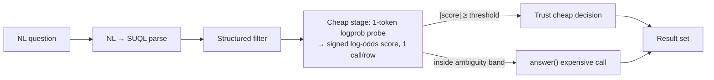
```mermaid
flowchart LR
    Q[NL question] --> P[NL → SUQL parse]
    P --> S[Structured filter]
    S --> C["Cheap stage: 1-token logprob probe<br/>→ signed log-odds score, 1 call/row"]
    C -->|"|score| ≥ threshold"| D[Trust cheap decision]
    C -->|inside ambiguity band| E["answer() expensive call"]
    D --> R[Result set]
    E --> R
```

**`trummer_baseline`** ([`operators.py`](<imdb/approaches/project Trummer/baseline/trummer_join/operators.py>)):
**no structured pushdown** — the full candidate pool, not just the
structurally-matching subset, must be covered. Movie rows and review rows
are partitioned into blocks (default 25 rows) and paired 1:1; each pair goes
to the expensive model in one call that must both **join** (recover row
identity from serialized text) and **judge** the semantic predicate.

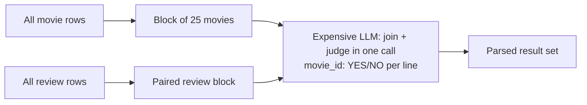
```mermaid
flowchart LR
    M[All movie rows] --> B1["Block of 25 movies"]
    Rv[All review rows] --> B2["Paired review block"]
    B1 --> J["Expensive LLM: join + judge in one call<br/>movie_id: YES/NO per line"]
    B2 --> J
    J --> R[Parsed result set]
```

**`trummer_v1`** ([`cascade.py`](<imdb/approaches/project Trummer/v1/trummer_join/cascade.py>),
[`structured_filter.py`](<imdb/approaches/project Trummer/v1/trummer_join/structured_filter.py>)):
adds a structured pre-filter (the one Trummer variant with pushdown), batches
the *cheap* pass 8-at-a-time, and re-verifies only `UNCERTAIN`/low-confidence
rows in expensive batches of 32.

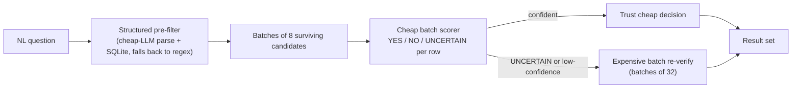
```mermaid
flowchart LR
    Q[NL question] --> SF["Structured pre-filter<br/>(cheap-LLM parse + SQLite, falls back to regex)"]
    SF --> B["Batches of 8 surviving candidates"]
    B --> CS["Cheap batch scorer<br/>YES / NO / UNCERTAIN per row"]
    CS -->|confident| Acc[Trust cheap decision]
    CS -->|UNCERTAIN or low-confidence| EX["Expensive batch re-verify<br/>(batches of 32)"]
    Acc --> R[Result set]
    EX --> R
```

### 3.2 Prompts (verbatim excerpts, with source)

**SUQL semantic judge** — used per-row by `suql_baseline`, and as the
expensive fallback in `suql_v1`
([`suql_engine.py`](<imdb/approaches/project SUQL/baseline/suql_engine.py>):276-294,
[`cascade_filter.py`](<imdb/approaches/project SUQL/v1/cascade_filter.py>):59-73):

```text
You are the final recall-first semantic filter for movie reviews.
Decide whether the review provides evidence that the movie satisfies
the question. Answer YES for direct wording, a synonym/paraphrase, a
described example, or a reasonable implication; count explicit mentions
even when negated, qualified, or critical (evidence retrieval, not
sentiment scoring). Answer NO when support is absent, generic, or based
only on genre/topic. Return exactly YES or NO. Do not include reasoning,
punctuation, or extra text.
```

**SUQL v1 cheap scorer** — a raw completion prompt (no chat roles), so the
`1`/`0` completion tokens' logprobs can be read off directly
([`scorer.py`](<imdb/approaches/project SUQL/v1/scorer.py>):157-167):

```text
Act as a high-recall first-pass semantic filter. Decide whether this
review contains review-specific evidence for a Yes answer. Count direct
wording, synonyms, described examples, or reasonable implications.
Return exactly one token: 1 for Yes, 0 for No.

{guidance_block}
Question: {question}
Review: {review[:1800]}

Answer:
```

**Trummer batch-join predicate** — one call judges an entire block pair at
once ([`operators.py`](<imdb/approaches/project Trummer/baseline/trummer_join/operators.py>):88-116):

```text
Find every movie in Collection 1 that has a review in Collection 2
satisfying this predicate: {predicate}
Act as a recall-first semantic filter, while requiring review-specific
evidence. [...evidence-retrieval rules, identical in spirit to the SUQL
judge above...]
A review belongs to a movie only when tconst is exactly equal to
movie_id. Return one decision per line as: movie_id: YES or movie_id: NO.
Collection 1: {block_1_rows}
Collection 2: {block_2_rows}
Decisions:
```

**Trummer v1 cheap batch prompt** — a three-way label instead of a
continuous score ([`cascade.py`](<imdb/approaches/project Trummer/v1/trummer_join/cascade.py>):18-25):

```text
Act as a high-recall first-pass semantic filter. Answer YES for direct
evidence, synonyms, described examples, or reasonable implications.
Answer UNCERTAIN when evidence is condition-specific but too weak or
ambiguous for a reliable YES. [...] Prefer UNCERTAIN over NO when
plausible condition-specific evidence exists.
```

Every one of these prompts is assembled with a `guidance` block injected at
render time — the semantic dictionary.

### 3.3 The semantic dictionary

[`imdb/benchmarks/semantic_dict/`](imdb/benchmarks/semantic_dict/) mines a
**prompt-context artifact**, not a keyword classifier — its `threshold` field
is enforced to always be `null`
([`semantic_dict_loader.py`](imdb/benchmarks/semantic_dict/semantic_dict_loader.py)).
10 categories (`categories.json`: e.g. `recommend_general`, `praise_humor`,
`criticize_pacing`) are each mined from a stratified 5,000-review sample,
split **70% mining / 30% holdout** — holdout text is never read again after
the split (`MINING_FRACTION = 0.70`,
[`mine_semantic_dict.py`](imdb/benchmarks/semantic_dict/mine_semantic_dict.py)).
Each category record holds:

- log-odds-scored lexical anchors (n-grams distinctive of that category),
- few-shot **positive** and **hard-negative** exemplars, chosen for diversity
  via k-means++ over sentence-transformer embeddings,
- a `template_type` (`recommend | praise | describe | criticize`).

At runtime, `semantic_dict_context.py`'s `semantic_guideline(question)` maps
the question to a category via lexical markers, then renders an *"advisory
prompt context, not a keyword rule"* block — anchors plus exemplars, with an
explicit instruction to *"judge only the current review... never treat an
exemplar as current evidence."* This string is injected into every semantic
judge prompt across all four methods (cached with `@lru_cache`). It is **not**
used by either structured NL→SQL parser — only by the free-text judges.

### 3.4 Cascade calibration (the mechanism shared by `suql_v1` and `trummer_v1`)

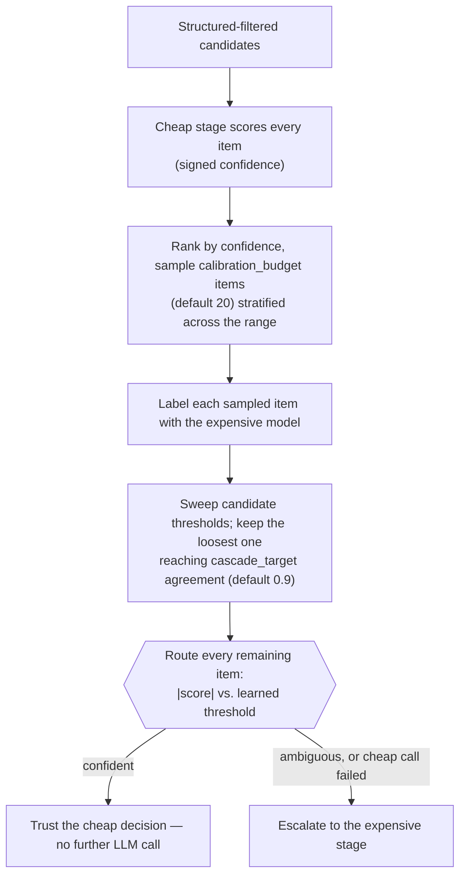
```mermaid
flowchart TD
    Cand[Structured-filtered candidates] --> Score["Cheap stage scores every item<br/>(signed confidence)"]
    Score --> Sample["Rank by confidence, sample calibration_budget items<br/>(default 20) stratified across the range"]
    Sample --> Oracle["Label each sampled item with the expensive model"]
    Oracle --> Learn["Sweep candidate thresholds; keep the loosest one<br/>reaching cascade_target agreement (default 0.9)"]
    Learn --> Route{{"Route every remaining item:<br/>|score| vs. learned threshold"}}
    Route -->|confident| Trust[Trust the cheap decision — no further LLM call]
    Route -->|ambiguous, or cheap call failed| Escalate[Escalate to the expensive stage]
```

Concretely: the cheap stage scores every structured candidate once
(log-odds per row for `suql_v1`, a three-way label per batch-of-8 for
`trummer_v1`); a small calibration sample (≤20 items, stratified by
confidence) is labeled by the expensive model as ground truth; the loosest
threshold that still reaches 90% agreement with that oracle is adopted; every
other candidate is routed by whether its cheap-stage confidence clears that
threshold. `manual_confidence_threshold` can override this entirely and skip
calibration.

**A repo-hygiene finding worth flagging**: `imdb/approaches/project
SUQL/v1/profiler.py` implements a separate, more principled **offline**
Beta-posterior lower-bound threshold fitter, and its output
(`thresholds.json`) is still checked in — but `CascadeAnswerFilter` stores the
path to that file and **never reads it**. The threshold actually used at
inference time is always the lightweight per-query calibration sample
described above, not the offline Beta-posterior fit. `profiler.py` /
`thresholds.json` currently look like unused legacy artifacts rather than a
live part of the pipeline.

---

## 4. Headline experiment results

Three result sets, at increasing breadth and decreasing depth — read them
together, not in isolation (§5 explains why the ranking changes between
them).

### 4.1 IMDb, 10 held-out questions × 10 repetitions, one model pair

The broadest single-model-pair result: `gemma4:e2b` (cheap) / `gemma4:26b`
(expensive), 10 genre-diverse held-out questions, 10 repetitions each
([`imdb/benchmarks/10q/outputs/heldout_diverse_10q_10rep_gemma4_e2b_26b_kraken_20260722/`](<imdb/benchmarks/10q/outputs/heldout_diverse_10q_10rep_gemma4_e2b_26b_kraken_20260722/>)).

| Method | Precision | Recall | F1 | Wall (s) | LLM calls | cheap / expensive |
|---|---:|---:|---:|---:|---:|---:|
| `suql_baseline` | 0.683 | 0.758 | 0.678 | 115.6 | 117.1 | 0 / 117.1 |
| `suql_v1` | 0.709 | 0.808 | 0.696 | **923.6** | 70.1 | 40.0 / 30.1 |
| `trummer_baseline` | 0.655 | 0.408 | 0.444 | 71.3 | 96.9 | 0 / 96.9 |
| **`trummer_v1`** | **0.810** | 0.750 | **0.757** | **35.1** | **10.0** | 5.0 / 5.0 |

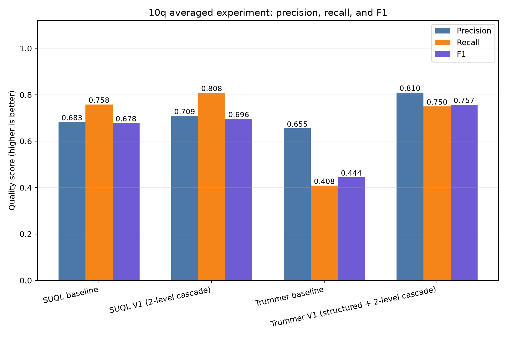
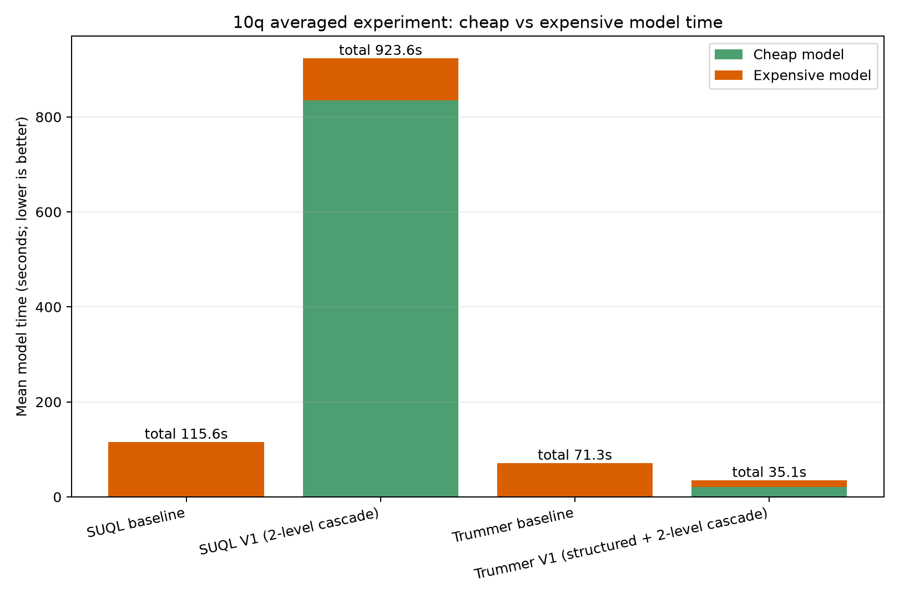

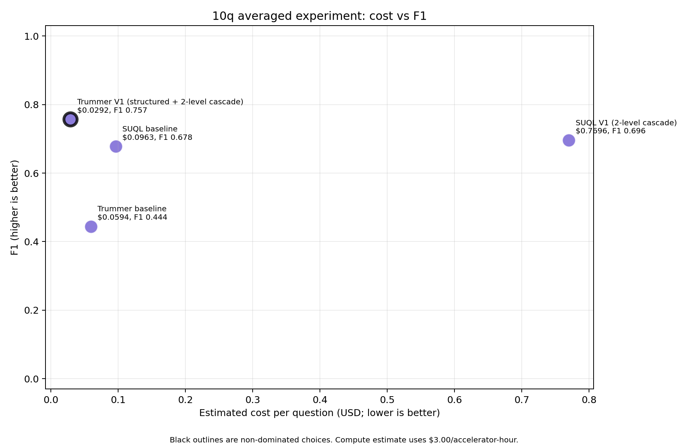

`trummer_v1` is the unique non-dominated point on the cost-F1 frontier —
lowest cost **and** highest F1 at once. `suql_v1`'s bar in the time chart is
tallest and 77%-dominated by its own "cheap" stage: an unbatched, one-token
completion still pays the full prompt-prefill cost of a review-length input,
so it is not actually cheap in wall time (§5).

### 4.2 Both datasets, 5 questions × 10 repetitions, across 4 model pairs

The broadest cross-model result: `gemma4:e2b/gemma4:26b`,
`qwen3.6:27b/qwen3.6:35b`, `gemma4:e2b/qwen3.6:35b` (cross-family), and
`llama3.1:8b/llama3.1:70b`, run on **both** datasets with the same 5-question
suite, 10 repetitions
([`imdb/experiments/imdb_5q_10rep/`](imdb/experiments/imdb_5q_10rep/),
[`amazon/experiments/amazon_5q_10rep/`](amazon/experiments/amazon_5q_10rep/)).

| Pair | Dataset | `suql_baseline` | `suql_v1` | `trummer_baseline` | `trummer_v1` |
|---|---|---:|---:|---:|---:|
| gemma4:e2b / gemma4:26b | IMDb | 0.520 | 0.448 | 0.425 | 0.411 |
| qwen3.6:27b / qwen3.6:35b | IMDb | 0.512 | 0.585 | 0.382 | 0.131 |
| gemma4:e2b / qwen3.6:35b (cross) | IMDb | 0.512 | 0.477 | 0.382 | 0.104 |
| llama3.1:8b / llama3.1:70b | IMDb | 0.518 | 0.518 | 0.350 | 0.137 |
| gemma4:e2b / gemma4:26b | Amazon | 0.883 | 0.795 | 0.527 | **0.883** |
| qwen3.6:27b / qwen3.6:35b | Amazon | 0.878 | 0.863 | 0.512 | 0.865 |
| gemma4:e2b / qwen3.6:35b (cross) | Amazon | 0.878 | 0.850 | 0.512 | **0.890** |
| llama3.1:8b / llama3.1:70b | Amazon | 0.844 | 0.844 | 0.485 | 0.563 |

*(F1 shown; full precision/recall/wall-time/call tables are in each pair's
`aggregate.csv`.)*

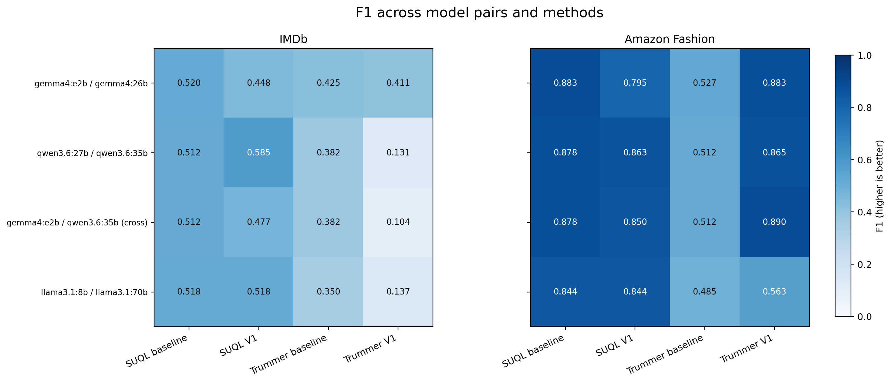

This heatmap is the single most important figure in this README: it is where
the two datasets' stories **diverge**, not agree (§5).

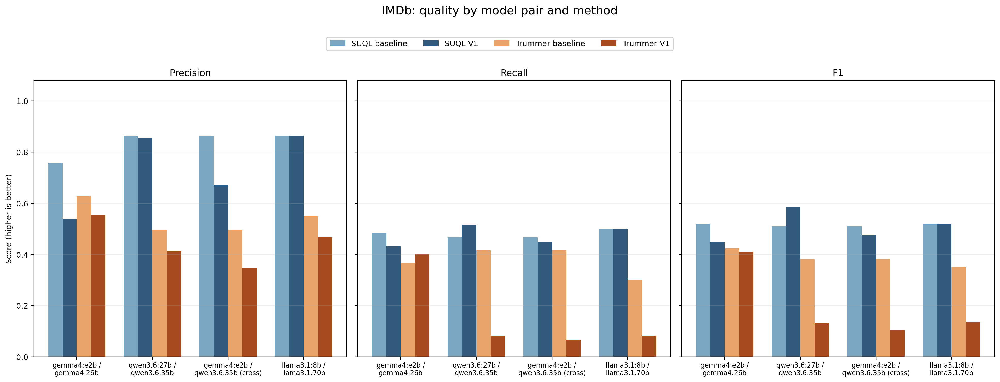
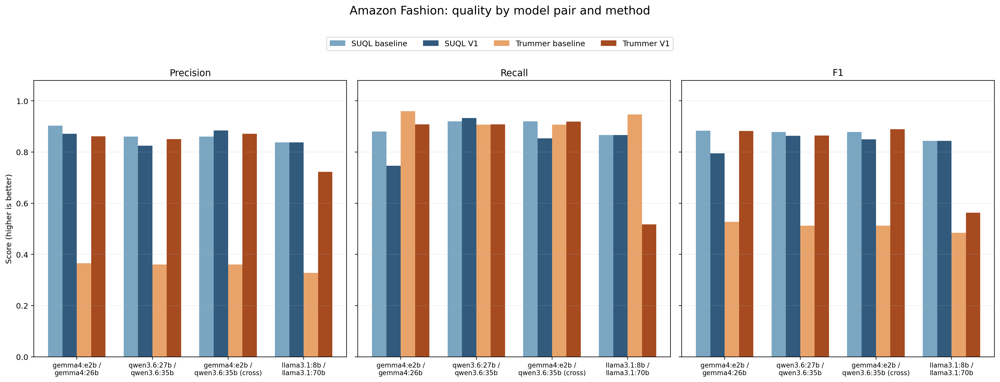

**Reliability caveat.** These runs predate a fix for a determinism bug: every
LLM call runs at temperature 0, and (before the fix) the calibration draw was
also deterministic, so all 10 "repetitions" reproduce each other exactly —
18 of 20 groups were byte-identical in the Amazon/gemma cell. Treat each cell
above as **n = 1**, not n = 10.
[`amazon/experiments/seed_verification/`](amazon/experiments/seed_verification/)
shows what changes once a seed varies the calibration draw per repetition: a
3q × 5rep check found `trummer_v1` on one question ranging from F1 0.750 to
0.968 — a spread wider than most of the between-pair differences in the
table above, so read pair rankings as directional, not exact.

### 4.3 Amazon: does candidate-pool size change the ranking?

[`amazon/benchmarks/scaling/`](amazon/benchmarks/scaling/) sweeps pool size
*n* ∈ {25, 50, 100, 200, 400, 800} on one question, Gemma pair.

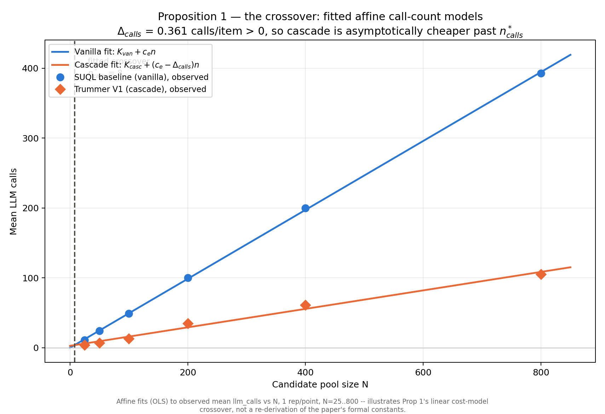
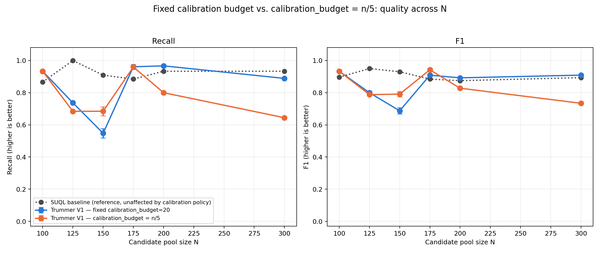

`trummer_v1`'s call/wall-time advantage over `suql_baseline` holds at every
*n* tested. Quality is the caveat: F1 = 0.00 at *n* = 25 and 0.40 at *n* = 50
(a fixed calibration budget of 20 samples is too large relative to a tiny
pool for the threshold search to produce anything usable), climbing to 0.77
at *n* = 100 and matching/exceeding baseline (0.89–0.92) from *n* ≈ 200
onward. Cheaper-than-baseline crosses over at *n* ≈ 25; cheaper **and**
within 85% of baseline F1 needs *n* ≈ 100.

### 4.4 What *not* to cite as current

`amazon/archive_generalized_pipeline_results/` (and `amazon/README.md`'s own
"10q, 10rep" table, which points at that archive) come from the deleted
`generalized_pipeline/` implementation, not the ported
`amazon/approaches/project {SUQL,Trummer}/` used everywhere above. They are
kept for provenance but are **not comparable** to any number in this section.
A 10-question × 10-repetition run of the *current* Amazon implementation, at
the same breadth as §4.1's IMDb run, does not exist yet — §4.2's 5-question,
4-model-pair matrix is the current Amazon headline.

---

## 5. Analysis: what actually explains these numbers

**Structured pushdown, not model strength, is the main lever.**
`trummer_baseline` is the only method without it, and it is the visible loser
on both datasets, for every model pair tested — just in different ways: on
IMDb it under-covers (recall collapses to 0.35–0.41, the model drifts partway
through a block before finishing its decisions); on Amazon it over-triggers
(precision collapses to 0.33–0.37 at recall ≥ 0.90, the adaptive block join
matches review text to the predicate far too liberally). `trummer_v1` adds
back exactly this pushdown and, where it works, roughly doubles F1 over its
own baseline while cutting calls 3–10×. This one change — not batching, not
the cascade — is doing most of the work.

**Batching the cheap stage decides whether cascading helps or hurts.**
`suql_v1`'s cheap stage is row-wise (batch size 1): a 1-token completion
still pays the full prompt-prefill cost of a review-length input, so its
per-row latency can *exceed* the expensive model's own per-call latency. The
result is visible in every wall-time chart in §4: `suql_v1` is the tallest
bar everywhere, 77% dominated by its own "cheap" stage, up to 8× slower than
its baseline on IMDb 10q for a +2.7% F1 gain. `trummer_v1`'s cheap stage
batches 8 candidates per call, driving effective per-row cheap cost an order
of magnitude below the expensive per-call cost — the same mechanism, with
the one design change (batching) that makes it pay off instead of backfire.

**`trummer_v1` is the best method when it generalizes — and on IMDb, it
often doesn't.** The §4.2 heatmap is the clearest evidence: on Amazon,
`trummer_v1` matches or beats `suql_baseline`'s F1 on **all four** model
pairs (0.563–0.890). On IMDb, it does that only for the Gemma/Gemma pair
(0.411, still the dataset's weakest cell) and **collapses to F1 0.10–0.14 for
the other three pairs** — qwen, llama, and the gemma/qwen cross-family pair
all fail the same way, which rules out a single-model quirk. This is a
genuine, currently unresolved brittleness in the calibrated-cascade design,
not a data artifact of one run (the repo's own
`multi_model_experiments/README.md` calls it "unexplained as of 2026-07-28").
Anyone building on `trummer_v1` should treat its IMDb-Gemma result as the
favorable case, not the default.

**`suql_v1` has its own named failure mode: degenerating into its baseline
while still paying for the discarded cheap pass.** Under `llama3.1`, on both
datasets, `suql_v1`'s precision/recall/F1 match `suql_baseline` to six
decimal places — but at ~2× the calls (98.6 vs. 48.6 on Amazon). The cascade
scores every candidate cheaply, learns no threshold that clears the 90%
agreement target, and falls back to routing everything to the expensive
model anyway. It is a real cascade failure mode (the calibration step simply
finds nothing worth trusting), not a bug — but it means `suql_v1` can be
strictly worse than doing nothing, on both cost axes at once.

**Selectivity is held fixed, and that matters for how far these rankings
generalize.** Every 10q-suite question fixes structured selectivity at 40%
(40 of 100 candidates); the ranking above is most informative at that
selectivity specifically. The repo's own smaller `1q/3q/5q` suites and the
Amazon scaling study (§4.3) are the available levers for probing this
further; a full selectivity sweep is still open work.

**A pre-restructuring 3q result hints the 10q ranking may not hold at
smaller scale, but needs re-running to confirm.** Six older
[`imdb/benchmarks/3q/outputs/`](imdb/benchmarks/3q/outputs/) runs (2026-07-21,
gemma and qwen pairs, 3-10 reps each), from before the `single_pass_join`
Trummer fix described in [`imdb/benchmarks/README.md`](imdb/benchmarks/README.md),
showed the *opposite* ranking from §4.1: both Trummer variants collapsed
(`trummer_baseline` F1 = 0.000 in 4 of 6 runs; `trummer_v1` never exceeded
0.103) while a SUQL variant won every run. The suggested mechanism —
3q's questions are more selective (fewer structured candidates survive
pushdown), leaving too little signal for the block-join and its cascade to
route or join reliably, while SUQL's per-row filter is unaffected by pool
size — is plausible and consistent with §4.3's Amazon finding that
`trummer_v1` needs *n* ≈ 100+ candidates to be reliable. But because these
runs predate the Trummer baseline fix that made its call cost comparable
(§0 of `imdb/benchmarks/README.md`: pre-fix numbers "are therefore not
comparable with runs made before this change"), this should be read as a
hypothesis carried over from before the restructuring, not a confirmed
current result — the 3q suite needs a re-run on the current implementation
before this ranking reversal can be trusted.

**Read repetition counts literally.** Per §4.2's reliability caveat, most
multi-pair numbers above are effectively single draws, not 10-repetition
means — differences smaller than the seeded-variance spread found in
`seed_verification/` (up to 0.22 F1 on one question) should be read as noise,
not signal.

---

## 6. Setup and running

**Prerequisites**: Python 3 and bash (a project-local `.venv` is created
automatically on first run), and either a local [Ollama](https://ollama.com)
server or access to the project's Aker/Kraken cluster for GPU runs.

### IMDb, locally

```bash
git clone <this-repo-url> && cd "lab m2"

# Smoke test: 1-question suite, all four methods, one repetition
bash imdb/benchmarks/1q/run_local.sh --pull-models

# The 5-question suite used in §4.2, 10 repetitions, default model pair
bash imdb/benchmarks/5q/run_local.sh --pull-models --repetitions 10

# Any suite, custom model pair and method subset
bash imdb/benchmarks/10q/run_local.sh --repetitions 10 \
  --cheap-model gemma4:e2b --expensive-model gemma4:26b \
  --methods "suql_v1 trummer_v1"
```

`run_local.sh` creates `.venv/`, installs
[`imdb/benchmarks/requirements.txt`](imdb/benchmarks/requirements.txt) into
it, optionally pulls missing Ollama models (`--pull-models`), and writes
`aggregate.csv`, `comparison.csv`, and `plots/` under
`imdb/benchmarks/<suite>/outputs/<run-name>/`.

### Amazon Fashion, locally

Amazon needs one extra one-time step to materialize per-question CSVs from
the raw source before the suite runners will work (re-run it after editing
`amazon/questions_10q.json` or `amazon/config.json`):

```bash
python3 amazon/benchmarks/build_subdatasets.py
bash amazon/benchmarks/5q/run_local.sh --pull-models --repetitions 10
```

Flags and output layout are identical to the IMDb runner above — the two
`run_local.sh` entry points are the same script.

### On the Aker/Kraken cluster

```bash
AKER_HOST=kraken bash imdb/benchmarks/10q/run_aker.sh --repetitions 10 --pull-models
AKER_HOST=kraken bash amazon/benchmarks/10q/run_aker.sh --repetitions 10 --pull-models
```

`run_aker.sh` defaults `AKER_ROOT` to a fixed remote path; if your account's
remote layout differs (as is currently the case for some IMDb jobs on
kraken), pass `AKER_ROOT=/your/remote/path` explicitly. Use
`--methods "..."`, `--cheap-model`, `--expensive-model` the same way as
locally; `--allow-cpu` overrides the default GPU requirement.

### Multiple repetitions and reproducibility

Every LLM call runs at temperature 0. Without a calibration seed, repeated
runs of a `v1` cascade are byte-identical (§4.2's reliability caveat) — set
`CALIBRATION_SEED` (done automatically per-repetition by
`repetitions.py`) or the newer `GENERALIZED_CASCADE_SEED` to get real
rep-to-rep variance. `suql_baseline` and `trummer_baseline` have no
calibration step and are deterministic by construction regardless.

### Regenerating this README's dataset plots (§1)

```bash
python3 docs/eda/imdb/generate_plots.py
python3 docs/eda/amazon/generate_plots.py
```

Each script reads directly from `{imdb,amazon}/canonical/` and overwrites its
own `docs/eda/<dataset>/*.png` — no other inputs required.
