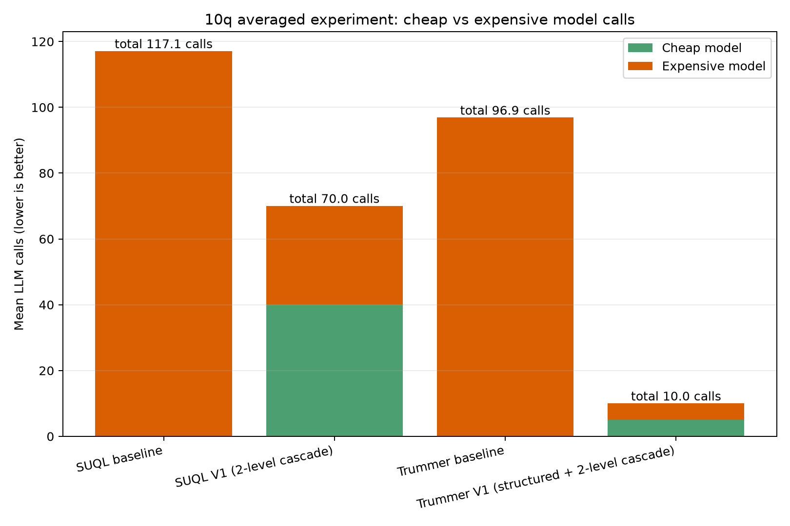
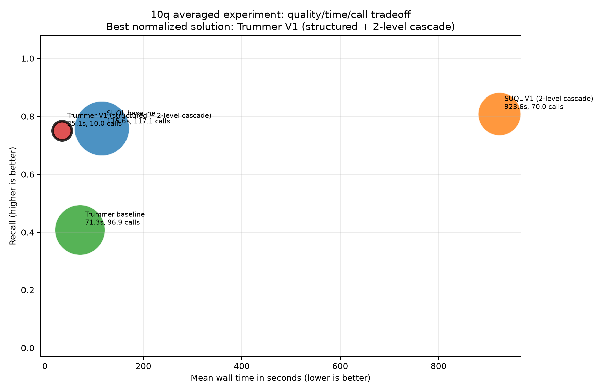

# Canonical benchmarks

The four suites share one runner and one implementation registry:

- `10q`: all ten diverse semantic/structured questions.
- `5q`: recommendation/year, fear/genre+runtime, visual/genre, pacing/director, originality/title.
- `3q`: recommendation/year, pacing/director, originality/title.
- `1q`: the recommendation/year smoke test.

Every question contains 100 candidate movies, 40 structured candidates, and 12 ground-truth
movies. Each suite contains `questions.txt`, `ground_truth_movies.txt`, a manifest,
and complete SUQL/Heterogen input CSVs.

## Dataset

IMDb-derived movie metadata (title, director, year, runtime, genres) paired
with movie reviews. Each question pairs a structured filter over the metadata
(e.g. year, genre, runtime) with a semantic predicate judged from review text
(e.g. "reviewers recommend it," "praised for pacing"). Ground truth is the
conjunction of both predicates: 12 of the 100 candidate movies per question,
with 40 of the 100 passing the structured filter alone. Runtime CSVs and
per-candidate annotations live in `data/subdatasets/<suite>/q_XX/` (see
[Dataset annotations](#dataset-annotations) below).

## Approach

All four suites compare exactly four semantic-query implementations:

| Flag | Code | Behavior |
|---|---|---|
| `suql_baseline` | `project SUQL/baseline/` | Vanilla structured-first SUQL; the main model evaluates surviving review predicates. |
| `suql_v1` | `project SUQL/v1/` | Structured-first SUQL with a cheap-to-expensive two-level cascade. |
| `trummer_baseline` | `project Trummer/baseline/` | Vanilla paper-style adaptive semantic block join using the main model; no structured pruning. |
| `trummer_v1` | `project Trummer/v1/` | Structured filtering followed by a cheap-to-expensive batched two-level cascade. |

`suql_baseline` and `trummer_baseline` always call the expensive model.
`suql_v1` and `trummer_v1` calibrate a cheap-model confidence threshold per
question/run and only escalate uncertain candidates to the expensive model.

Local example (creates `.venv` and runs all four methods against Ollama):

```bash
bash benchmarks/1q/run_local.sh --pull-models
```

Aker example:

```bash
bash benchmarks/5q/run_aker.sh --repetitions 10 --methods "suql_v1 trummer_v1" --pull-models
```

Each run keeps only publication-ready output by default:

- `aggregate.csv`: one averaged row per implementation;
- `comparison.csv`: one row per question and implementation;
- `plots/`: quality, time, call-count, and trade-off plots;
- `per_question/q_XX/plots/`: the same four plots for each question.

Pass `--keep-run-artifacts` directly to `shared/scripts/run_all.py` only when
debugging raw predictions or model responses.

## Dataset annotations

Runtime CSVs live in `data/subdatasets/<suite>/q_XX/`. Every question includes
`annotations.csv`, with one auditable row per candidate movie:

- `structured_match` and `semantic_label` record the two predicate decisions;
- `ground_truth` records their final conjunction;
- `annotation_source` identifies the labeling policy;
- `evidence_excerpt` provides review evidence for the semantic decision;
- `annotation_rationale` explains inclusion or exclusion.

The paired `benchmark.json` records the natural-language query, parsed
structured predicate, semantic predicate, and ground-truth movie IDs.

## Experiment details

Sixteen runs are versioned under `<suite>/outputs/`:

| Suite | Runs | Purpose |
|---|---|---|
| `1q` | 9 runs, `gemma4:e2b`/`e4b` and `qwen3`, 1 repetition each | Early per-implementation smoke tests on the single recommendation/year question, run before scaling up. Most runs cover one method per output directory; `local_balanced_recovery_qwen3_1rep` covers all four in one run. |
| `3q` | 6 runs, 3-10 repetitions, model pairs `gemma4:12b/26b`, `gemma4:e2b/31b` (thinking on and off), `qwen3.6:27b/35b` (thinking off), plus a `universal_schema_v3` variant for `gemma4:12b/26b` and `qwen3.6:27b/35b` | "Structured recall" stress test on the three harder, more selective questions (recommendation/year, pacing/director, originality/title), across model pairs and a reasoning on/off comparison. |
| `10q` | 1 run, `gemma4:e2b` (cheap) / `gemma4:26b` (expensive), 10 repetitions | `heldout_diverse_10q_10rep_gemma4_e2b_26b_kraken_20260722` — the primary, canonical benchmark: all ten diverse questions, 10 reps each, run on Kraken. |

No `5q` runs are versioned yet.

## Results

### 10q — canonical benchmark (primary result)

`gemma4:e2b` / `gemma4:26b`, 10 questions × 10 reps
([`heldout_diverse_10q_10rep_gemma4_e2b_26b_kraken_20260722/`](10q/outputs/heldout_diverse_10q_10rep_gemma4_e2b_26b_kraken_20260722/)):

| Method | Precision | Recall | F1 | Wall (s) | LLM calls | cheap / expensive |
|---|---:|---:|---:|---:|---:|---:|
| `suql_baseline` | 0.683 | 0.758 | 0.678 | 115.6 | 117.1 | 0 / 117.1 |
| `suql_v1` | 0.709 | 0.808 | 0.696 | 923.6 | 70.1 | 40.0 / 30.1 |
| `trummer_baseline` | 0.655 | 0.408 | 0.444 | 71.3 | 96.9 | 0 / 96.9 |
| **`trummer_v1`** | **0.810** | 0.750 | **0.757** | **35.1** | **10.0** | 5.0 / 5.0 |






`trummer_v1` wins outright on this suite: highest precision and F1, at
roughly a third of `suql_baseline`'s wall time and a tenth of its call count.
`trummer_baseline` (the same block-join method without structured pruning) is
the weakest method on every metric except call count, which shows the
pruning step — not the model itself — is what makes `trummer_v1` competitive.
`suql_v1`'s 923.6s mean wall time is an outlier: its 40 cheap calls alone
took 834s (~21s/call), far slower than a "cheap" model call should be —
consistent with resource contention on the shared Kraken node rather than a
property of the cascade itself; its call count and quality are otherwise
in line with `suql_baseline`.

### 3q — structured-recall stress test

Six runs across model pairs, averaged per suite (3-10 reps each). F1 per method:

| Model pair (reps) | `suql_baseline` | `suql_v1` | `trummer_baseline` | `trummer_v1` |
|---|---:|---:|---:|---:|
| `gemma4:12b`/`26b` (10) | 0.247 | **0.342** | 0.000 | 0.051 |
| `gemma4:e2b`/`31b` (5) | **0.295** | 0.291 | 0.000 | 0.048 |
| `gemma4:e2b`/`31b`, thinking on (5) | **0.282** | 0.275 | 0.051 | 0.103 |
| `qwen3.6:27b`/`35b`, thinking off (5) | 0.323 | **0.345** | 0.000 | 0.000 |
| `gemma4:12b`/`26b`, universal_schema_v3 (3) | 0.256 | **0.335** | 0.051 | 0.051 |
| `qwen3.6:27b`/`35b`, universal_schema_v3 (3) | 0.318 | **0.345** | 0.051 | 0.051 |

Plots per run: [`3q/outputs/*/plots/`](3q/outputs/).

Both Trummer variants collapse on this suite — `trummer_baseline` scores 0.0
F1 in 4 of 6 runs, and `trummer_v1` never exceeds 0.103 — while a SUQL
variant (baseline or v1) wins every single run. This is the opposite ranking
from the 10q result above: with only 40 structured candidates per question
and a much more selective structured predicate (recommendation/year,
pacing/director, originality/title), the block-join and its cascade have too
little signal to route or join reliably, whereas SUQL's per-row structured
filter still works normally.

The thinking-on/off pair (`gemma4:e2b`/`31b`, rows 2 and 3) isolates the cost
of enabling the model's reasoning mode: wall time increases 2.4-4.5x across
all four methods (`suql_baseline` 52.0s -> 233.7s, `suql_v1` 57.4s -> 216.9s,
`trummer_baseline` 10.8s -> 26.2s, `trummer_v1` 16.6s -> 41.0s) with no
consistent quality improvement — F1 is flat or worse for the SUQL methods and
moves within noise for the near-zero Trummer methods. On this workload,
thinking mode is a pure cost, not a quality lever.

### 1q — early validation runs

Single-repetition smoke tests on the recommendation/year question, run before
scaling to 3q/10q. Not statistically meaningful individually, but directionally
consistent with the larger suites:

| Run | `suql_baseline` R | `suql_v1` R | `trummer_baseline` R | `trummer_v1` R |
|---|---:|---:|---:|---:|
| `fixed_retrieval` (`gemma4:e2b`/`e4b`) | 0.917 | 0.917 | 0.083 | 0.917 |
| `recall_first` (`gemma4:e2b`/`e4b`, Aker CPU) | 0.083 | 0.083 | 0.083 | 0.250 |
| `local_balanced_recovery` (`qwen3`) | 0.833 | 0.833 | 0.417 | 0.167 |

Plots per run: [`1q/outputs/*/plots/`](1q/outputs/).

`trummer_baseline` has the lowest or tied-lowest recall in every one of these
runs too, reinforcing the 10q and 3q pattern: unpruned block-join is the
weakest implementation regardless of model pair or question.

## Conclusions

- **`trummer_baseline` (block join with no structured pruning) is the
  consistently weakest method across all three suites and every model pair
  tested.** It never leads on quality and only "wins" on call count by doing
  less useful work. Structured pruning, not model capability, is the
  differentiator.
- **`trummer_v1`'s advantage is workload-dependent, not universal.** It is
  the best method by a wide margin on the primary 10-question canonical
  benchmark (highest F1, ~3x faster, ~10x fewer calls than `suql_baseline`),
  but it collapses alongside `trummer_baseline` on the smaller, more
  selective 3-question suite, where every SUQL variant stays well ahead. The
  cascade and block join need enough candidates surviving structured pruning
  to calibrate and batch against; with only ~40 structured candidates and a
  tighter predicate, there's too little signal for either Trummer method to
  route reliably.
- **SUQL is the more robust default across question shapes**: it never
  collapses to near-zero the way Trummer does on 3q, even though it loses to
  `trummer_v1` on 10q. `suql_v1`'s cascade gives a modest quality bump over
  `suql_baseline` on most runs, at the cost of highly variable wall time
  (see the 10q outlier above).
- **Enabling model "thinking" mode roughly triples wall time with no
  reliable quality gain** on this workload (3q thinking-on/off comparison,
  all four methods) — not worth the cost here.

Net recommendation for the paper: report `trummer_v1` as the strongest
result on the canonical 10q benchmark, but use the 3q stress suite to show
that its win is conditional on candidate volume, not a blanket claim that
structured pruning + cascade beats SUQL everywhere.
