# Common Benchmark 10Q Model Comparison

This directory collects plots and aggregate metrics from the saved
`common_benchmark_10q/outputs/` runs so the model-pair comparison is visible in
one place.

The main quality criterion here is macro recall across the ten benchmark
questions. Precision, F1, wall time, and call counts are reported as tradeoff
metrics, not as the primary ranking criterion.

## Source Runs

| Source run | Scope | Cheap model | Expensive model | Repetitions |
| --- | --- | --- | --- | ---: |
| `gemma4_e2b_e4b_10q_11reps_20260705_184848` | SUQL, V2_3, V3, V3_2 | `gemma4:e2b` for cascades | `gemma4:e4b` | 11 |
| `heterogen_struc_cascade` | V2_3, V3, V3_2 only | `gemma4:e2b` | `gemma4:e4b` | 11 |
| `heterogen_v2_3_v3_v3_2_gemma3_12b_gemma4_26b_10q_10reps_20260706_130841` | V2_3, V3, V3_2 only | `gemma3:12b` | `gemma4:26b` | 10 |
| `suql_stage2_vs_v3_2_gemma4_e2b_e4b_10q_11reps_20260706_002904` | SUQL_STAGE2, V3_2 | `gemma4:e2b` | `gemma4:e4b` | 11 |

See [`metrics_summary.csv`](metrics_summary.csv) for the compact numeric table.

## Overall Conclusion

Across the saved aggregate rows, the best macro-recall result is generated by
`gemma3:12b -> gemma4:26b` with the V2_3 batched exact-ID cascade:

| Run | Method | Precision | Recall | F1 | Mean wall time | Mean LLM calls |
| --- | --- | ---: | ---: | ---: | ---: | ---: |
| `heterogen_v2_3_v3_v3_2_gemma3_12b_gemma4_26b_10q_10reps_20260706_130841` | V2_3 | 0.328 | 0.953 | 0.482 | 19.156 s | 10.380 |

This result beats the best `gemma4:e2b -> gemma4:e4b` aggregate row in the
saved outputs, which is `SUQL_STAGE2` with recall 0.759. It also beats the
standard SUQL baseline row from the full all-methods run, where SUQL reaches
recall 0.621 using `gemma4:e4b`.

The tradeoff is precision. V2_3 reaches the highest recall by accepting many
more candidates, which lowers precision to 0.328 and F1 to 0.482. If precision
and F1 are treated as secondary tie-breakers, the best balanced saved row is
V3_2 with `gemma3:12b -> gemma4:26b`: recall 0.816, precision 1.000, and F1
0.888.

The caveat is scope: the strongest row is from a heterogen-only run, so it does
not include a same-run SUQL baseline with `gemma4:26b`. Within the one saved run
that contains SUQL baseline and all three heterogen methods, the best quality
row by recall is SUQL baseline with `gemma4:e4b`.

## Heterogen-Only Conclusion

For heterogeneous methods only, `gemma3:12b -> gemma4:26b` is clearly better
than `gemma4:e2b -> gemma4:e4b` when recall is the main quality metric.

| Model pair | Best recall method | Precision | Recall | F1 | Mean wall time | Mean LLM calls |
| --- | --- | ---: | ---: | ---: | ---: | ---: |
| `gemma3:12b -> gemma4:26b` | V2_3 | 0.328 | 0.953 | 0.482 | 19.156 s | 10.380 |
| `gemma4:e2b -> gemma4:e4b` | V3_2 | 0.990 | 0.494 | 0.607 | 5.948 s | 4.691 |

The larger model pair mainly improves recall. V2_3 with `gemma3:12b ->
gemma4:26b` raises recall to 0.953, nearly doubling the best heterogen recall
seen with `gemma4:e2b -> gemma4:e4b`. It is slower and less precise, so this is
the right choice when missing positives is the dominant error.

If the recall-first comparison needs a precision guardrail, V3_2 with
`gemma3:12b -> gemma4:26b` is the strongest balanced heterogen option: recall
0.816, precision 1.000, and F1 0.888. The model-pair change also improves V3
substantially: V3 moves from recall 0.214 on `gemma4:e2b -> gemma4:e4b` to
0.564 on `gemma3:12b -> gemma4:26b`.

## Plot Sets

### Full all-methods run: `gemma4:e2b -> gemma4:e4b`

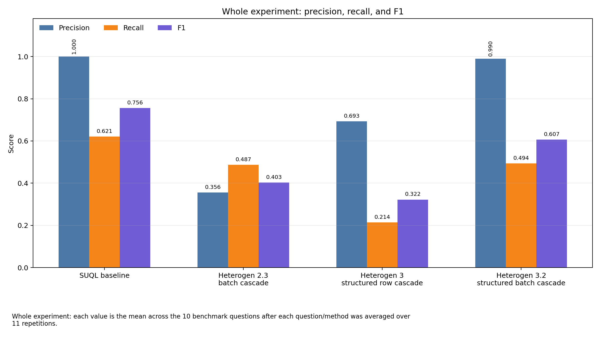

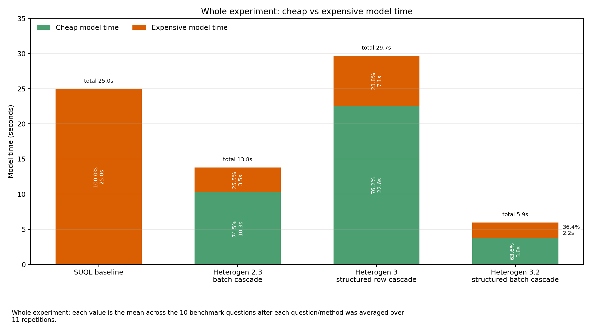

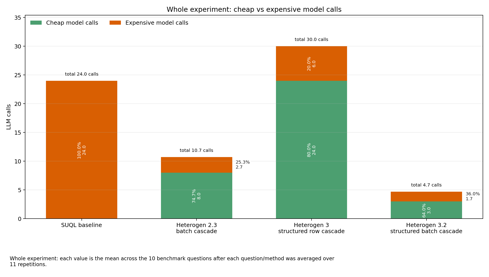

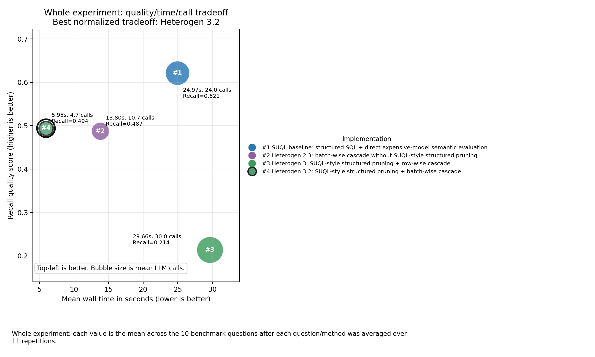

### Heterogen only: `gemma4:e2b -> gemma4:e4b`

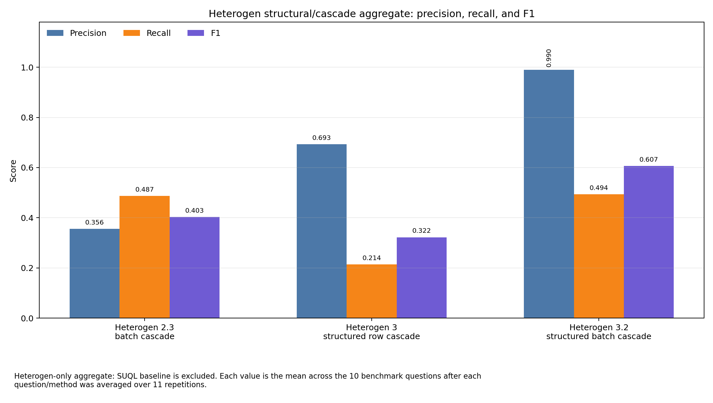

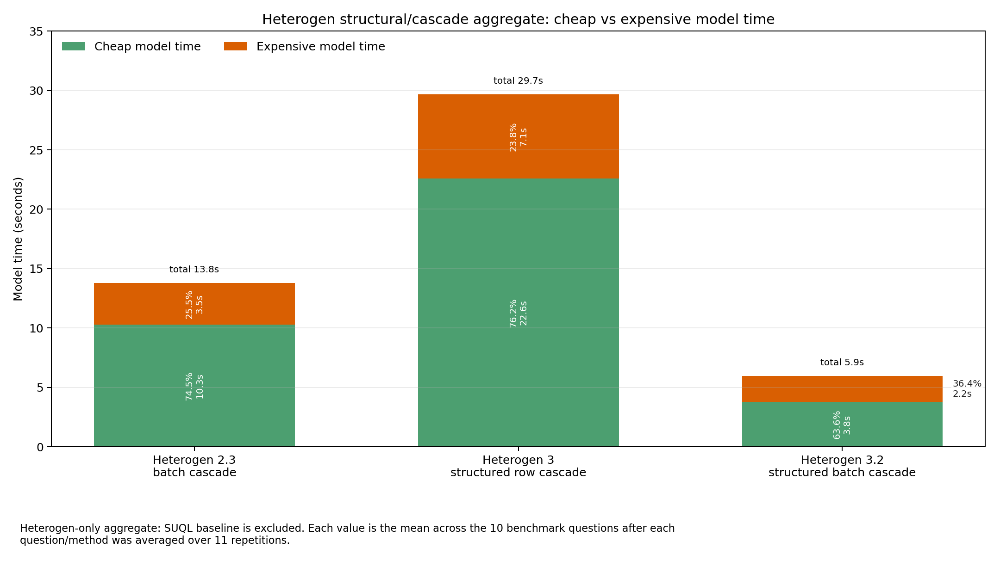

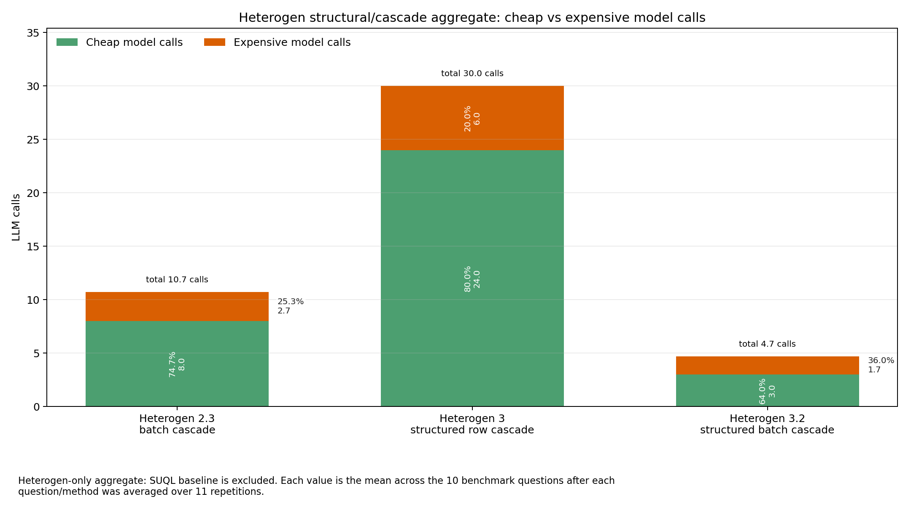

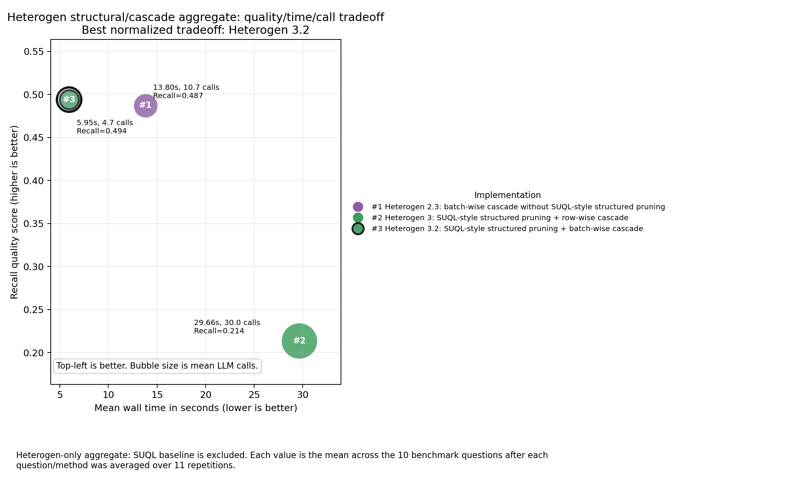

### Heterogen only: `gemma3:12b -> gemma4:26b`

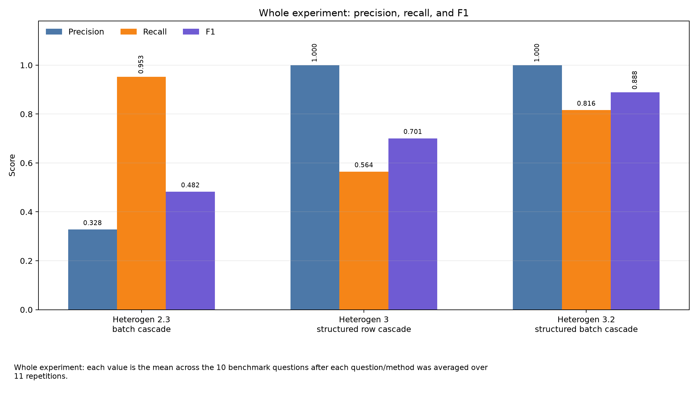

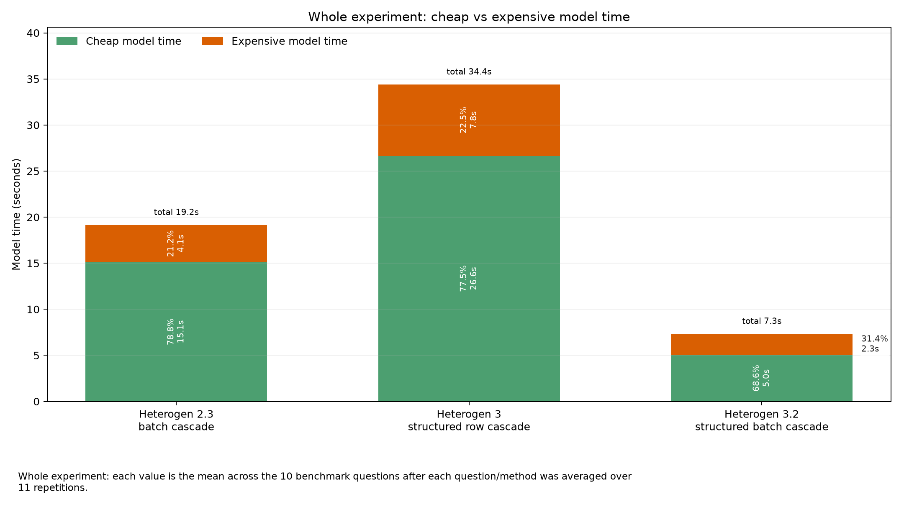

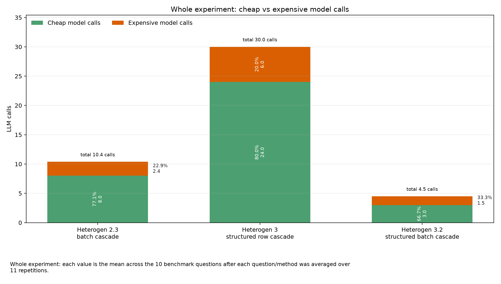

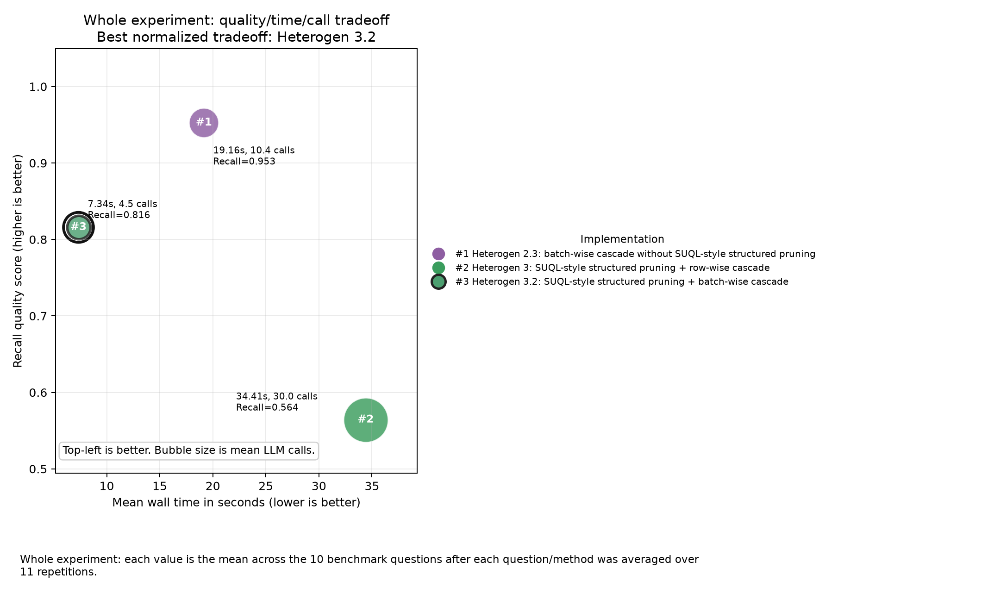

### SUQL_STAGE2 versus V3_2: `gemma4:e2b -> gemma4:e4b`

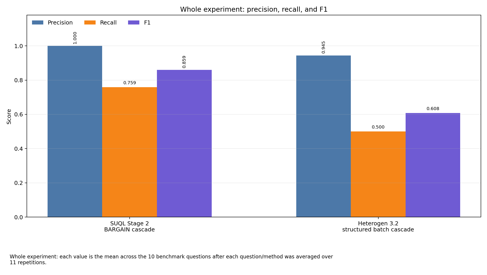

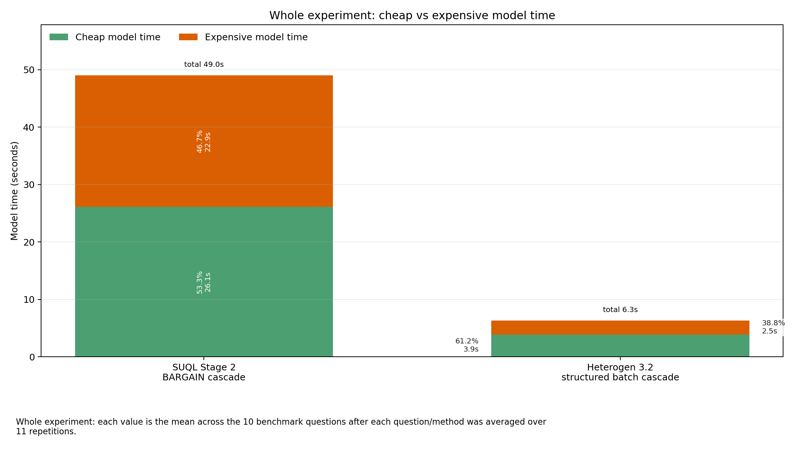

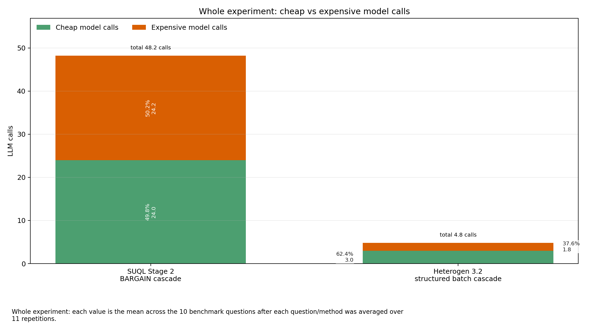

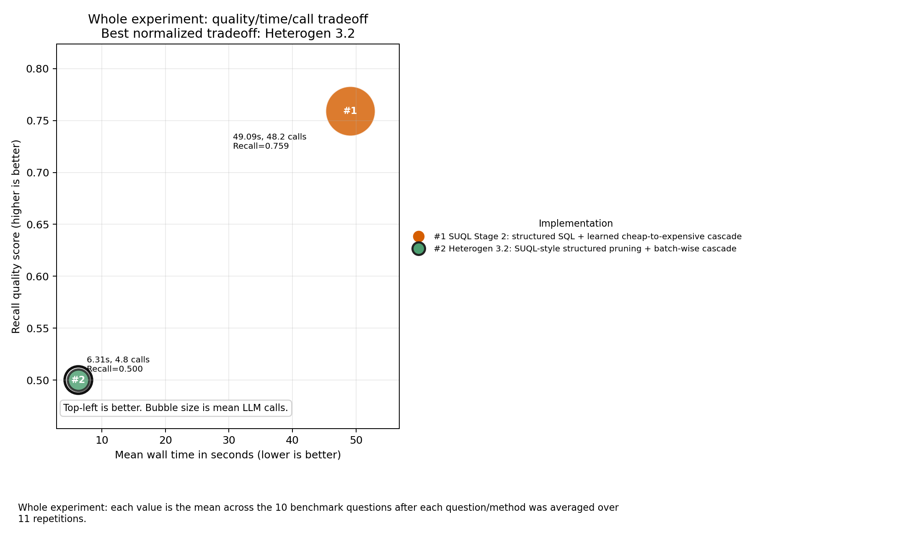
