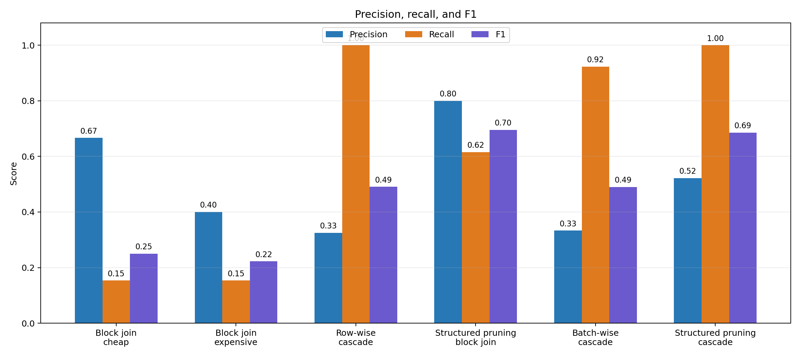
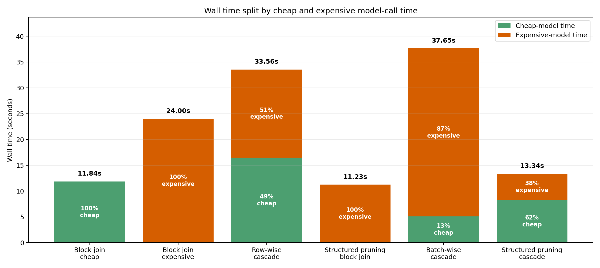
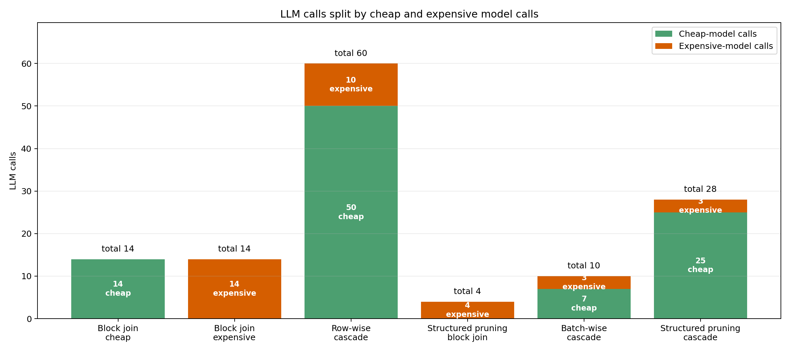

# Common benchmark v3: Trummer heterogen variants

## Description

`common_benchmark_v3/` reuses the 50-row, 13-answer dataset from
`common_benchmark_v2`, but changes the focus from SUQL-vs-Trummer to execution
plan variants for heterogeneous semantic joins. It supports two related
workflows:

- `run_all.py`: compares SUQL baseline plus the Trummer heterogen variants.
- `run_all_heterogen.py`: compares only V1, V2, V2_2, V2_3, and V3, with
  repetition averaging and Aker helpers for longer all-Heterogen runs.

Use this suite when the question is which physical plan is responsible for cost
or quality changes: unpruned block join, exact-ID row-wise cascade, structured
pruned block join, batched cascade, or structured-pruned cascade. The focused
plots intentionally emphasize the three primary execution shapes: `Block join`,
`Row-wise cascade`, and `Batch-wise cascade`.

This benchmark compares:

- `project SUQL/src_baseline`: structured-first SUQL baseline;
- `project Trummer/heterogen_v1`: bounded Trummer block join, with no cascade;
- `project Trummer/heterogen_v2_2`: question-derived structured pruning
  followed by Trummer block prompts for sentiment matching;
- `project Trummer/heterogen_v2_3`: exact-ID candidates classified in cheap
  batches, with uncertain candidates coalesced into larger expensive batches;
- `project Trummer/heterogen_v3`: question-derived structured pruning
  followed by the cheap-to-expensive cascade;
- `project Trummer/heterogen_v2`: exact-ID candidate generation followed by a
  cheap-to-expensive cascade.

It reuses the fixed 50-row dataset and 13-ID ground truth from
`common_benchmark_v2`.

## Dedicated all-Heterogen one-question experiment

The dedicated workflow runs these five implementations on the same
50-movie/50-review dataset and one fixed question:

- Heterogen V1: sequential block join;
- Heterogen V2: pair-level cheap-to-expensive cascade;
- Heterogen V2_2: structured-pruned block join;
- Heterogen V2_3: batched cheap-to-expensive cascade;
- Heterogen V3: structured-pruned cascade.

Model defaults:

```text
cheap cascade model: gemma4:e2b
expensive and non-cascading model: gemma4:e4b
block-join completion cap: 512 tokens
```

### Local dry-run validation

```bash
cd "/Users/annremizova/Desktop/lab m2"
python3 common_benchmark_v3/scripts/run_all_heterogen.py \
  --dry-run \
  --outputs-dir /tmp/all_heterogen_dry
```

### Full Aker workflow

Local Mac — synchronize the benchmark and implementations:

```bash
cd "/Users/annremizova/Desktop/lab m2"
bash common_benchmark_v3/scripts/sync_all_heterogen_to_aker.sh
```

Aker login node — submit the GPU job:

```bash
cd /home/daisy/remizova/common_benchmark_v3_workspace
PULL_MODELS=1 \
WALLTIME=08:00:00 \
bash common_benchmark_v3/scripts/submit_aker_all_heterogen.sh
```

The submission prints an `OUTPUT_NAME` such as
`all_heterogen_20260625_153000`. Keep it for result retrieval or partial
reruns.

Monitor from the Aker login node:

```bash
oarstat -u "$USER"
oarstat -f -j <jobid>
tail -F common_benchmark_v3/logs/all_heterogen_oar_<jobid>.out
tail -F common_benchmark_v3/logs/all_heterogen_<jobid>_*.console.log
```

Local Mac — retrieve one completed experiment:

```bash
OUTPUT_NAME=all_heterogen_20260625_153000 \
  bash common_benchmark_v3/scripts/pull_all_heterogen_from_aker.sh
```

### Partial rerun

Reuse the original `OUTPUT_NAME` and skip every successful implementation. For
example, rerun only V2_3:

```bash
cd /home/daisy/remizova/common_benchmark_v3_workspace
OUTPUT_NAME=all_heterogen_20260625_153000 \
SKIP_V1=1 \
SKIP_V2=1 \
SKIP_V2_2=1 \
SKIP_V3=1 \
PULL_MODELS=0 \
bash common_benchmark_v3/scripts/submit_aker_all_heterogen.sh
```

### Generated metrics and plots

Each implementation keeps `run_metrics.json` and its evidence or routing
artifacts. The experiment root additionally contains:

- `all_metrics.csv`: all collected and derived metrics;
- `experiment_config.json`: exact models, learned-cascade calibration settings,
  batch sizes, and limits;
- `movie_id_outcomes.csv`: TP/FP/FN outcome per movie and implementation;
- `summary.md`: compact interpretation table;
- `metrics_precision_recall_f1.png`: precision, recall, and F1 for cheap block
  join, expensive block join, row-wise cascade, structured-pruned block join,
  batch-wise cascade, and structured-pruned cascade;
- `time_bar_plot.png`: wall time for the same implementations, split by
  cheap-model and expensive-model call-time percentage where available;
- `calls_bar_plot.png`: cheap-model and expensive-model call counts for the same
  implementations.

For V1 and V2_2, all LLM time is expensive time.

Current saved Qwen3 11-repetition comparison:

| Version | Wall time | Total LLM calls | Cheap calls | Expensive calls | Final rows | Precision | Recall | F1 |
| --- | ---: | ---: | ---: | ---: | ---: | ---: | ---: | ---: |
| Block join cheap | 11.84 s | 14 | 14 | 0 | 3.00 | 0.667 | 0.154 | 0.250 |
| Block join expensive | 24.00 s | 14 | 0 | 14 | 5.00 | 0.400 | 0.154 | 0.222 |
| Row-wise cascade | 33.56 s | 60 | 50 | 10 | 40.00 | 0.325 | 1.000 | 0.491 |
| Structured pruning block join | 11.23 s | 4 | 0 | 4 | 10.00 | 0.800 | 0.615 | 0.696 |
| Batch-wise cascade | 37.65 s | 10 | 7 | 3 | 36.00 | 0.333 | 0.923 | 0.490 |
| Structured pruning cascade | 13.34 s | 28 | 25 | 3 | 24.91 | 0.522 | 1.000 | 0.686 |







## Fair comparison contract

All implementations start from all 50 movie rows and all 50 review rows. The
task requires:

1. movie year is 1998;
2. `movie_id = tconst`;
3. the review is negative, critical, or strongly unfavorable.

SUQL applies structured SQL filters first, then evaluates `answer(review, ...)`
on surviving rows. V1 evaluates the full predicate through bounded block-join
prompts. V2_2 extracts structured predicates from the question
against the movie-table schema, applies them before prompting, prunes reviews
by exact ID, and asks the block join only for the remaining semantic condition.
V3 uses the same structured pruning as V2_2, then scores each pruned exact-ID
candidate with the original pair-level cheap scorer. Only uncertain candidates
reach the expensive model, whose fallback work is coalesced into at most 4
calls by default.
V2 first creates the 50 exact-ID candidates, scores each candidate with the cheap
model, and sends only uncertain candidates to the expensive model.
V2_3 keeps the same exact-ID candidate set but changes request granularity:
one cheap request scores a batch of candidates, while larger expensive batches
coalesce uncertain candidates from multiple cheap batches.

V1 returns schema-constrained `matching_movie_ids` copied from each movie block.
This avoids positional pair-index failures while preserving the block-join
execution strategy. Its `join_stats.csv` includes raw responses and parsed-pair
counts.

## Local validation

```bash
cd "/Users/annremizova/Desktop/lab m2"
python3 -m unittest discover -s common_benchmark_v3/tests -v
python3 common_benchmark_v3/scripts/run_all.py \
  --cheap-model ollama/gemma4:e2b \
  --expensive-model ollama/gemma4:e4b \
  --dry-run
```

Run the real local benchmark:

```bash
python3 common_benchmark_v3/scripts/run_all.py \
  --api-base http://127.0.0.1:11434 \
  --cheap-model ollama/gemma4:e2b \
  --expensive-model ollama/gemma4:e4b \
  --parallel-workers 4
```

Run only the SUQL/v2_2/v3/v2 comparison in a clean output directory:

```bash
python3 common_benchmark_v3/scripts/run_all.py \
  --api-base http://127.0.0.1:11434 \
  --cheap-model ollama/gemma4:e2b \
  --expensive-model ollama/gemma4:e4b \
  --skip-v1 \
  --skip-v2-3 \
  --outputs-dir outputs/v3_compare_gemma4e
```

Outputs are written under:

```text
common_benchmark_v3/outputs/cheap_<cheap>__expensive_<expensive>/
```

The directory contains per-implementation evidence and metrics plus
`comparison.csv`, `comparison.md`, `movie_id_outcomes.csv`, and the three
focused plots:

- `metrics_precision_recall_f1.png`;
- `time_bar_plot.png`;
- `calls_bar_plot.png`.

## Aker GPU

Local Mac:

```bash
cd "/Users/annremizova/Desktop/lab m2"
bash common_benchmark_v3/scripts/sync_common_benchmark_to_aker.sh
```

Aker login node:

```bash
cd /home/daisy/remizova/common_benchmark_v3_workspace
CHEAP_MODEL=gemma4:e2b \
EXPENSIVE_MODELS="gemma4:e4b" \
PULL_MODELS=1 \
WALLTIME=08:00:00 \
bash common_benchmark_v3/scripts/submit_aker_common_benchmark.sh
```

Progress on Aker:

```bash
oarstat -u "$USER"
oarstat -f -j <jobid>
tail -F common_benchmark_v3/logs/oar_<jobid>.out
tail -F common_benchmark_v3/logs/*_<jobid>_*.console.log
```

Local Mac after completion:

```bash
bash common_benchmark_v3/scripts/pull_common_benchmark_from_aker.sh
```

V2 and V3 both use the pair-level scorer. Cascade thresholds are learned per
run from an expensive-model calibration sample; the operational defaults are
`--cascade-target 0.9` and `--calibration-budget 20`.
