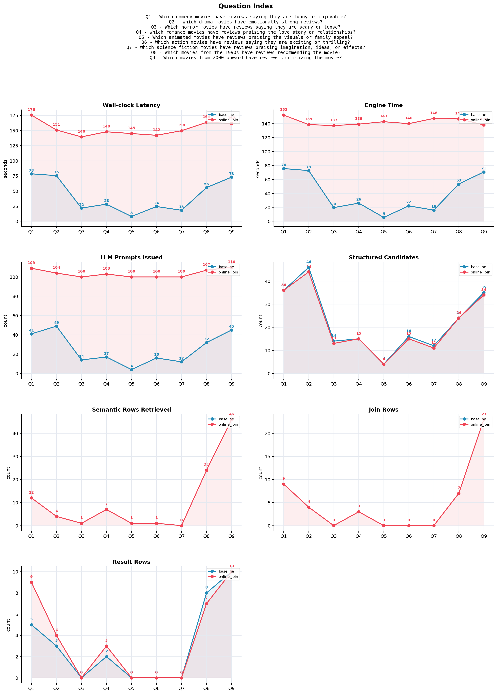

# SUQL Movie Retrieval

Master 2 final project on hybrid querying over structured IMDb metadata and unstructured movie reviews.

This repository compares two implementations inspired by Stanford OVAL's SUQL work: a baseline engine that first applies structured SQL filters before asking an LLM to evaluate review text, and an online-join engine that retrieves structured and semantic results independently before joining them.

## Project Overview

The project explores natural-language querying over movie data with both relational and semantic constraints. A user can ask questions such as:

```text
Which horror movies under 100 minutes have terrifying reviews?
```

The system translates the question into a SUQL-style query, evaluates standard predicates such as `year`, `runtime`, `director`, and `genres` with SQLite, and evaluates free-text review predicates with LLM-backed operators:

- `answer(review, question)`: returns a yes/no or short factual answer for a review.
- `summary(review)`: produces a concise natural-language review summary for the output table.

## Repository Structure

```text
.
├── benchmark_compare.py          # Benchmark runner for baseline vs online-join execution
├── src_baseline/                 # Structured-first SUQL implementation
├── src_online_join/              # Parallel structured/semantic retrieval implementation
├── benchmarks/                   # Benchmark metrics and small sampled data
└── data/                         # Local data workspace; large CSV/TSV files are not tracked
```

## Implementations

| Implementation | Directory | Strategy |
| --- | --- | --- |
| Baseline | `src_baseline/` | Runs structured SQLite filters first, then applies LLM `answer()` calls only to surviving rows. |
| Online join | `src_online_join/` | Runs structured retrieval and semantic review retrieval separately, then joins results by movie id. |

Both implementations expose the same command-line interface and support natural-language questions as well as raw SUQL queries.

## Analytics

The figure below summarizes the benchmark comparison between the structured-first baseline and the online-join implementation on the medium-difficulty 9-query benchmark.



Regenerate the plot from the committed metrics CSV with:

```bash
python scripts/generate_benchmark_plot.py
```

## Setup

Create a Python environment from the repository root:

```bash
python3 -m venv .venv
source .venv/bin/activate
pip install -r requirements.txt
```

The engines use LiteLLM with an Ollama-compatible local endpoint by default:

```bash
export SUQL_API_BASE="http://localhost:11434"
export SUQL_MODEL="ollama/phi4-mini"
export SUQL_CHEAP_MODEL="ollama/gemma2:2b"
export SUQL_EXPENSIVE_MODEL="ollama/phi4-mini"
```

## Data

Large IMDb-derived CSV/TSV files are intentionally excluded from git. Place the local datasets under `data/`:

```text
data/
├── imdb_joined.csv
├── imdb_reviews.csv
├── imdb_structured_joined.csv
├── name.basics.tsv
├── title.basics.tsv
└── title.crew.tsv
```

The benchmark script can also use sampled data under `benchmarks/data_sample_100/`, which is useful for quick local checks.

## Usage

Run the baseline implementation:

```bash
cd src_baseline
python main.py "What are the top 5 movies released in 1999 considered amazing in reviews?"
```

Run the online-join implementation:

```bash
cd src_online_join
python main.py "Which science fiction movies have reviews praising imagination or effects?"
```

Run a raw SUQL query:

```bash
python main.py --suql "SELECT movie_id, title, year, genres, summary(review) AS review_summary FROM movies WHERE genres LIKE '%Drama%' AND answer(review, 'Is this film emotionally moving?') = 'Yes' LIMIT 5;"
```

## Benchmarks

From the repository root:

```bash
python benchmark_compare.py --sample-size 100
```

For full-data benchmarking, use:

```bash
python benchmark_compare.py --sample-size 0
```

Full-data runs require the large local data files and can be substantially slower for the online-join implementation because semantic retrieval may scan many reviews.

## References

This implementation is based on the SUQL idea and Stanford OVAL reference implementation:

- Shicheng Liu, Jialiang Xu, Wesley Tjangnaka, Sina J. Semnani, Chen Jie Yu, and Monica S. Lam. "SUQL: Conversational Search over Structured and Unstructured Data with Large Language Models." arXiv:2311.09818, 2023. https://arxiv.org/abs/2311.09818
- Stanford OVAL. `stanford-oval/suql`: SUQL reference implementation. https://github.com/stanford-oval/suql

## Notes

This work was prepared as a Master 2 final project. It is intended for academic experimentation around hybrid structured and unstructured retrieval, LLM-assisted query operators, and execution-strategy comparison.
