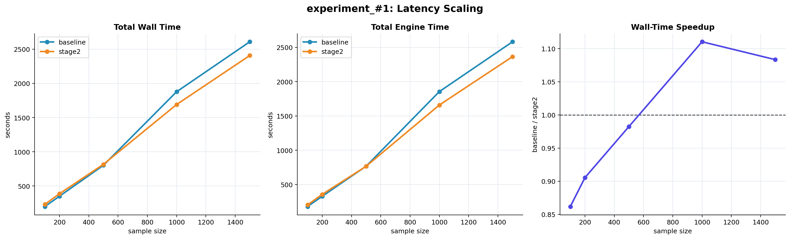
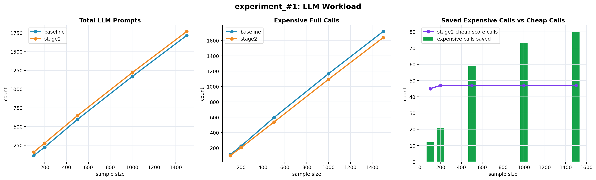
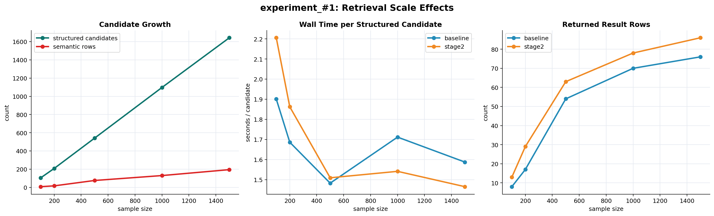

# experiment_#1 Sample Size Analysis

This analysis aggregates all available `Stage_2/benchmarks/experiment_#1_*/metrics.csv`
runs in this workspace:

- `experiment_#1_100`
- `experiment_#1_200`
- `experiment_#1_500`
- `experiment_#1_1000`
- `experiment_#1_1500`

All five runs contain 9 successful baseline queries and 9 successful Stage 2
queries. These `experiment_#1_*` runs use `ollama/llama3.2:1b` as the cheap
Stage 2 model and `ollama/phi4-mini` as the expensive model.

## Plots

## Summary

| Sample size | Baseline wall s | Stage 2 wall s | Stage 2 wall delta | Baseline engine s | Stage 2 engine s | Expensive calls saved | Stage 2 cheap calls |
|---:|---:|---:|---:|---:|---:|---:|---:|
| 100 | 199.58 | 231.60 | +32.02 | 178.83 | 203.06 | 12 | 45 |
| 200 | 350.75 | 387.41 | +36.66 | 328.70 | 356.88 | 21 | 47 |
| 500 | 802.18 | 816.62 | +14.44 | 766.86 | 766.28 | 59 | 47 |
| 1000 | 1877.73 | 1691.01 | -186.72 | 1854.38 | 1658.60 | 73 | 47 |
| 1500 | 2608.41 | 2407.43 | -200.98 | 2581.16 | 2364.50 | 80 | 47 |

## Conclusions

1. Runtime grows mainly with the number of structured candidates, not directly
   with the nominal sample size. Across the 9-query benchmark, structured
   candidates grow from 105 at sample size 100 to 1643 at sample size 1500.

2. The baseline is better on small samples. At sample sizes 100 and 200, Stage 2
   is slower because it pays 45-47 cheap scoring calls but saves only 12-21
   expensive calls.

3. The break-even point is around the 500-row run. At sample size 500, Stage 2
   wall time is still slightly worse, but engine time is effectively tied:
   766.28 seconds for Stage 2 versus 766.86 seconds for baseline.

4. Stage 2 becomes useful on larger samples. At sample size 1000, Stage 2 is
   about 10 percent faster in wall time and engine time. At sample size 1500,
   Stage 2 remains about 8 percent faster.

5. The reason Stage 2 improves with larger samples is that the cheap-model
   overhead is almost fixed in these runs, while expensive-call savings increase
   with sample size. Cheap score calls stay around 47, while expensive calls
   saved rise from 12 at sample size 100 to 80 at sample size 1500.

6. Total prompt count is not the best optimization signal here. Stage 2 issues
   more total prompts at every sample size because cheap scores are counted as
   prompts. The performance gain comes from replacing some expensive
   `phi4-mini` full calls with cheaper `llama3.2:1b` score calls.

7. Result counts differ between baseline and Stage 2, so these plots should be
   interpreted as performance comparisons for the saved experimental runs, not
   as a strict identical-output latency benchmark.

## Generated Data

- `summary_by_sample_and_project.csv`: aggregate totals by sample size and
  implementation.
- `paired_comparison.csv`: baseline-vs-Stage 2 deltas and speedups by sample
  size.

