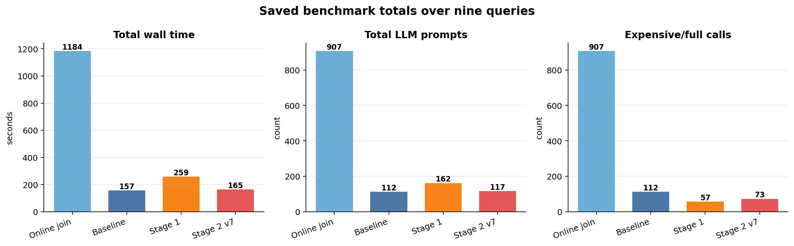

# SUQL Implementation Comparison

This note summarizes the current repository experiments comparing four execution strategies:

- **Baseline**: structured SQL filtering first, then full LLM `answer()` on remaining candidate reviews.
- **Online join**: structured and semantic retrieval are evaluated independently, then joined on `movie_id`.
- **Stage 1**: calibrated early accept/reject thresholds around `answer()`.
- **Stage 2 v7**: cheap-to-expensive cascade with per-question routing.

## Plots

### Four-system summary

This plot summarizes saved benchmark totals over nine SUQL queries. Online join is much slower because it evaluates the semantic predicate over nearly the whole review sample for each query. Stage 2 v7 keeps the prompt count close to baseline while reducing expensive calls.

### Online join vs Stage 2 v7

This is the strictest direct comparison in the repo. Both systems use the same Stage 2 sample and the same nine query set.

| Metric | Online join | Stage 2 v7 |
|---|---:|---:|
| Wall time | 1184.45 s | 164.56 s |
| Engine time | 1132.63 s | 132.98 s |
| LLM prompts | 907 | 117 |
| Expensive/full calls | 907 | 73 |
| Result rows | 7 | 11 |

Stage 2 v7 is about **7.2x faster wall-clock** and uses about **7.8x fewer LLM prompts**. The reason is physical query planning: Stage 2 applies structured predicates before semantic evaluation, while online join scans the review side semantically before joining.

### Baseline vs latest Stage 2

Stage 2 v7 is the best Stage 2 variant so far. It uses cheap scoring only for query types where previous runs showed a payoff.

| Metric | Baseline | Stage 2 v7 |
|---|---:|---:|
| Wall time | 157.40 s | 164.56 s |
| Engine time | 134.89 s | 132.98 s |
| LLM prompts | 112 | 117 |
| Expensive/full calls | 112 | 73 |
| Cheap score calls | 0 | 33 |
| Cheap rejects | 0 | 32 |

The important result is not a large wall-clock win yet. Stage 2 v7 is slightly slower in wall time, but slightly faster in engine time and substantially reduces expensive calls. This suggests the cascade is doing useful semantic pruning, but the local model overhead and summarization variance still hide much of the benefit.

### Baseline vs Stage 1

Stage 1 introduced calibrated early decisions inspired by cascade filtering. It reduced full answer calls in the saved run, but the score calls were still expensive.

| Metric | Baseline | Stage 1 |
|---|---:|---:|
| Wall time | 179.55 s | 259.23 s |
| Engine time | 157.58 s | 228.46 s |
| LLM prompts | 112 | 162 |
| Full calls | 112 | 57 |

The lesson from Stage 1 is that reducing full calls is not enough. The first-stage scorer must be genuinely cheaper than the full model call.

## Implementation Takeaways

1. **Baseline is a strong default** because structured pruning happens before LLM review checks.
2. **Online join is poor for this workload** because the semantic branch scans too many reviews before the join.
3. **Stage 1 proves the threshold idea** but fails as a speed optimization when the scoring call is not cheap.
4. **Stage 2 v7 is the best optimized implementation** because it combines structured pruning, cheap scoring, strict early accept, cheap early reject, and per-question routing.
5. **The remaining bottleneck** is model-call overhead. Further gains likely require batching, better calibrated cheap thresholds, or a backend that exposes faster scoring/logit access.

## Presentation

The full LaTeX slide deck is available at:

- [`docs/presentations/system_comparison_slides.tex`](presentations/system_comparison_slides.tex)
- [`docs/presentations/system_comparison_slides.pdf`](presentations/system_comparison_slides.pdf)
